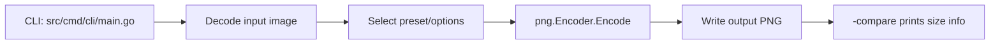

# CLI Compression Check (cursor-meetup.png) Implementation Plan

> **For Codex:** REQUIRED SKILL: `superpowers:executing-plans` to run tasks step-by-step with checkpoints.

**Goal:** Verify the Go CLI can compress `images/cursor-meetup.png` reliably (including already-optimized PNGs) and document the exact CLI usage/flags with an example outputting into `compress/`.

**Architecture:** Use the existing Go CLI entrypoint (`src/cmd/cli/main.go`) to encode PNG using `github.com/mac/go-pixo/src/png` presets. Validate by producing an output PNG to `compress/`, comparing sizes, and ensuring the resulting file decodes correctly.

**Tech Stack:** Go CLI (`go run`), `src/png` encoder, optional benchmark mode; documentation updates in `CLI.md`.

## User Stories
- As a user, I can run the CLI against `images/cursor-meetup.png` and get a valid output PNG written to `compress/`.
- As a user, I can see whether the output is smaller/larger for an already-compressed PNG via CLI output (`-compare`, `-benchmark`, `-verbose`).
- As a contributor, I can follow `CLI.md` to run the CLI with common flags and understand what to expect when the input PNG is already optimized.

## Tasks
### Task 1: Run the CLI on `cursor-meetup.png`
**Files:**
- Verify input exists: `images/cursor-meetup.png`
- Write output to: `compress/cursor-meetup.png`

**Steps:**
1. Create output directory: `mkdir -p compress`
2. Run CLI (balanced preset, lossless):  
   `env -u GOROOT go run ./src/cmd/cli -input images/cursor-meetup.png -output compress/cursor-meetup.png -preset balanced -compare -verbose`
3. Confirm output file exists and decodes:  
   `file compress/cursor-meetup.png`  
   `env -u GOROOT go run ./src/cmd/cli -input compress/cursor-meetup.png -output /tmp/reencode.png -preset fast`

### Task 2: Document CLI usage with flags
**Files:**
- Modify: `CLI.md`

**Steps:**
1. Add a “Quickstart” section showing a minimal command and output path.
2. Add a “Flags” section listing supported flags from `src/cmd/cli/main.go` with short explanations.
3. Add an example for already-compressed PNGs explaining that size may not reduce and suggesting:
   - `-compare` to see original vs compressed
   - `-benchmark -benchmark-runs N` to see stability across runs
   - `-preset max` / `-preset extreme` for more aggressive compression

### Task 3: Repo workflow validation
**Steps (must pass):**
1. Go tests: `env -u GOROOT go test ./...`
2. Go lint: `env -u GOROOT golangci-lint run`
3. Web lint (no warnings): `cd web && PATH=\"$(pwd)/node_modules/.bin:$PATH\" rescript build 2>&1 | grep -qi \"Warning\" && exit 1 || exit 0`
4. Commit changes.

## Acceptable Criteria
- Running the CLI command against `images/cursor-meetup.png` produces `compress/cursor-meetup.png`.
- The output PNG is valid (decodes without error).
- CLI output includes size comparison when `-compare` is used.
- `CLI.md` includes a copy/pasteable example using `images/cursor-meetup.png` and writing to `compress/`.
- Repo validations pass: Go tests, Go lint, and ReScript build without warnings.

## Findings
- `cursor-meetup.png` may already be optimized; output size reduction is not guaranteed.
- Environment may have `GOROOT` set incompatibly; use `env -u GOROOT` for Go tooling consistency.

## Risks
- “Already compressed” inputs can produce a larger output; users may interpret this as a bug.
- Web build can fail if a `rescript watch` process is already running; may need to stop it before `rescript build`.

## Assumptions
- `images/cursor-meetup.png` exists locally in the repo.
- `golangci-lint` is installed and runnable.
- `web/node_modules` exists (or can be installed) so `rescript build` can run.

## Optional: Diagram

