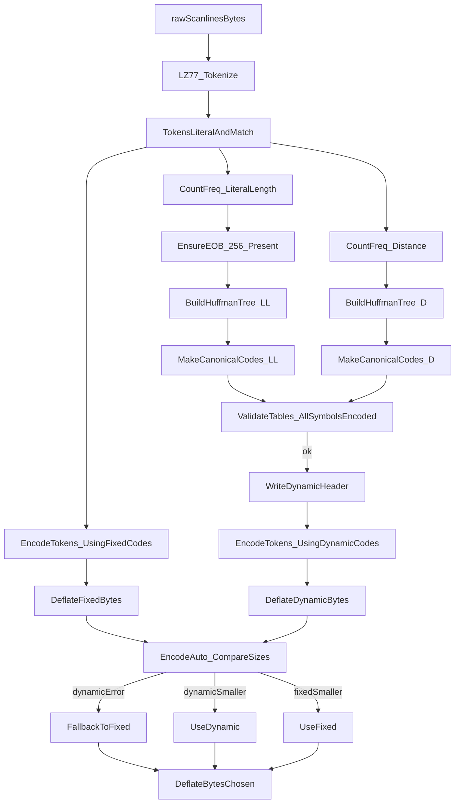
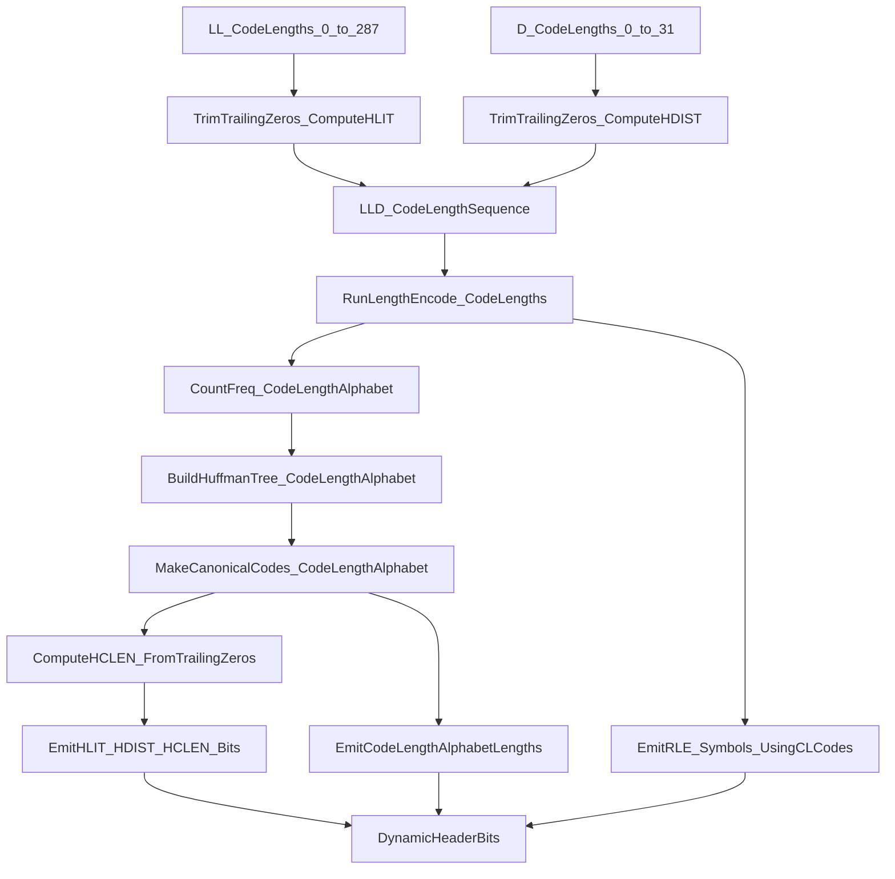

## Goal

- `EncodeAuto` must **never fail just because dynamic encoding fails**; it should return fixed output.
- Dynamic Huffman encoding must become **correct and stable** (no `invalid symbol`, dynamic block tests pass), so PNG can default back to auto-selection.

## Key files to touch

- [`/Users/mac/WebApps/projects/go-pixo/src/compress/deflate_encoder.go`](/Users/mac/WebApps/projects/go-pixo/src/compress/deflate_encoder.go)
- [`/Users/mac/WebApps/projects/go-pixo/src/compress/deflate_block.go`](/Users/mac/WebApps/projects/go-pixo/src/compress/deflate_block.go)
- [`/Users/mac/WebApps/projects/go-pixo/src/compress/dynamic_tables.go`](/Users/mac/WebApps/projects/go-pixo/src/compress/dynamic_tables.go)
- (Likely) [`/Users/mac/WebApps/projects/go-pixo/src/compress/huffman_tree.go`](/Users/mac/WebApps/projects/go-pixo/src/compress/huffman_tree.go)
- (If header bug) [`/Users/mac/WebApps/projects/go-pixo/src/compress/huffman_header.go`](/Users/mac/WebApps/projects/go-pixo/src/compress/huffman_header.go)
- [`/Users/mac/WebApps/projects/go-pixo/src/png/idat_writer.go`](/Users/mac/WebApps/projects/go-pixo/src/png/idat_writer.go)

## Implementation approach

### 1) Reproduce and lock in behavior with tests

- Run failing tests that currently exercise dynamic blocks (the ones that were failing before: dynamic-block/huffman-header/dynamic-tables).
- Add/adjust focused unit tests to ensure we catch this class of bug:
  - `EncodeAuto` fallback test:
    - Given input where the dynamic path errors, `EncodeAuto` returns the fixed output and **no error**.
  - `EncodeAuto` happy-path test:
    - If both fixed and dynamic succeed, it returns the smaller output.
  - Dynamic Huffman “must encode EOB” test:
    - Ensure dynamic table build + dynamic block writing always produces a non-zero code for **End-of-Block (256)** (otherwise encoding will fail later with `invalid symbol`).
  - Dynamic Huffman “no zero-length code for emitted symbols” invariant test:
    - For a representative token stream (literals + at least one match), assert every symbol we attempt to encode has a code with `Length > 0` in the dynamic tables (this directly catches the current failure mode).

### 2) Fix `EncodeAuto` fallback semantics

- In `DeflateEncoder.EncodeAuto(data)`:
- Always compute `fixed` first.
- Attempt `dynamic`.
- If `dynamic` errors, return `fixed, nil`.
- If both succeed, return smaller of the two.

### 3) Fix the dynamic Huffman path (root cause)

We’ll chase the exact symbol that triggers `invalid symbol` (a code with `Length == 0`) and fix the upstream construction.

- Validate `countTokenFrequencies` and tokenization ensures required symbols exist:
- Ensure **End-of-Block (256)** is included in literal/length frequencies.
- Ensure distance frequencies are valid when matches exist.

- Harden `BuildDynamicTables` (and/or `BuildTree`):
- Handle degenerate cases correctly:
  - **0 symbols** / all-zero frequencies (should still build valid minimal tables or route to stored/fixed).
  - **1-symbol trees** (must still assign a valid code length; DEFLATE requires at least two codes in practice — common fix is injecting a second dummy symbol).
- Enforce DEFLATE code-length limits (literal/length and distance max 15).

- If dynamic header encoding is involved:
- Verify `HLIT/HDIST/HCLEN` derivation and the code-length alphabet encoding.
- Ensure emitted code-length sequences match what the decoder expects (no missing codes).

### 4) Re-enable PNG auto selection safely

- Update `png` IDAT compression path to use `EncodeAuto` again (since it will be safe + dynamic will be fixed).
- Keep the fallback behavior inside `EncodeAuto` as defense-in-depth.

## Visualizations

### Overview: tokenization → tables → EncodeAuto selection

### Dynamic header: HLIT/HDIST/HCLEN + code-length alphabet + RLE

## Verification (must pass before we stop)

- `go test ./...`
- Run CLI compression on at least:
- `/Users/mac/WebApps/projects/go-pixo/images/code.png`
- `/Users/mac/WebApps/projects/go-pixo/images/cursor-2025-models.png`
- Confirm outputs land in `/Users/mac/WebApps/projects/go-pixo/images/compress/` and that:
- The encoder succeeds with no `invalid symbol` errors.
- Auto selection works (dynamic chosen when it’s smaller; fixed used when dynamic fails or is larger).