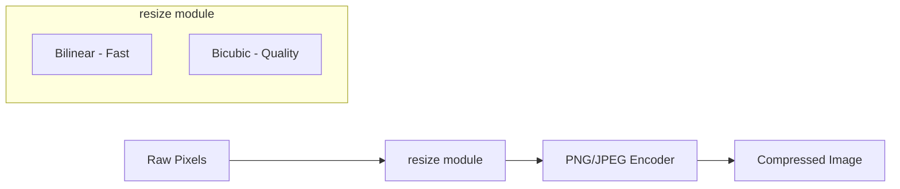

# Image Resolution Resizing Plan

## Overview

Add the ability to resize images before encoding, following pixo's zero-dependency philosophy. The resize module will be a preprocessing step that works with decoded pixel data before it's passed to PNG/JPEG encoders.

## Architecture



## 1. Rust Library (`src/resize/`)

Create a new `resize` module at `src/resize/mod.rs` with:

**Core types:**

```rust
pub enum ResizeMethod {
    Bilinear,  // 2x2 neighborhood, fast
    Bicubic,   // 4x4 neighborhood, better quality
}

pub struct ResizeOptions {
    pub width: u32,
    pub height: u32,
    pub method: ResizeMethod,
}
```

**Public API:**

```rust
// Main resize function - works on raw pixel data
pub fn resize(
    data: &[u8],
    src_width: u32,
    src_height: u32,
    dst_width: u32,
    dst_height: u32,
    color_type: ColorType,
    method: ResizeMethod,
) -> Result<Vec<u8>>

// Convenience: resize maintaining aspect ratio
pub fn resize_fit(
    data: &[u8],
    src_width: u32,
    src_height: u32,
    max_width: u32,
    max_height: u32,
    color_type: ColorType,
    method: ResizeMethod,
) -> Result<(Vec<u8>, u32, u32)>  // Returns (pixels, new_w, new_h)
```

**Implementation files:**

- [`src/resize/mod.rs`](src/resize/mod.rs) - Public API and types
- [`src/resize/bilinear.rs`](src/resize/bilinear.rs) - Bilinear interpolation (2x2 neighborhood)
- [`src/resize/bicubic.rs`](src/resize/bicubic.rs) - Bicubic interpolation (4x4 neighborhood)

The implementation will process each color channel independently (like zune-imageprocs does), supporting all `ColorType` variants (Gray, GrayAlpha, Rgb, Rgba).

## 2. CLI (`src/bin/pixo.rs`)

Add new CLI arguments to [`src/bin/pixo.rs`](src/bin/pixo.rs):

```rust
/// Resize image to exact dimensions (WxH, e.g., "800x600")
#[arg(long, value_name = "WxH")]
resize: Option<String>,

/// Resize to fit within max dimensions, maintaining aspect ratio
#[arg(long, value_name = "WxH")]
resize_fit: Option<String>,

/// Scale image by percentage (e.g., 50 for half size, 200 for double)
#[arg(long, value_name = "PERCENT")]
scale: Option<u32>,

/// Resize interpolation method
#[arg(long, value_enum, default_value = "bilinear")]
resize_method: ResizeMethodArg,
```

**Example usage:**

```bash
pixo photo.png -o small.jpg --resize 800x600
pixo photo.png -o thumb.jpg --resize-fit 200x200
pixo photo.png -o half.jpg --scale 50
pixo photo.png -o quality.jpg --resize 1920x1080 --resize-method bicubic
```

## 3. WASM API (`src/wasm.rs`)

Add a new resize function to [`src/wasm.rs`](src/wasm.rs):

```rust
/// Resize raw pixel data.
///
/// # Arguments
/// * `data` - Raw pixel data as Uint8Array
/// * `src_width` - Original width
/// * `src_height` - Original height
/// * `dst_width` - Target width
/// * `dst_height` - Target height
/// * `color_type` - 0=Gray, 1=GrayAlpha, 2=Rgb, 3=Rgba
/// * `method` - 0=Bilinear (fast), 1=Bicubic (quality)
///
/// # Returns
/// Resized pixel data as Uint8Array
#[wasm_bindgen(js_name = "resizeImage")]
pub fn resize_image(
    data: &[u8],
    src_width: u32,
    src_height: u32,
    dst_width: u32,
    dst_height: u32,
    color_type: u8,
    method: u8,
) -> Result<Vec<u8>, JsError>
```

This allows the web app to resize before encoding, keeping the encode functions simple.

## 4. Web App (`web/src/`)

### TypeScript wrapper ([`web/src/lib/wasm.ts`](web/src/lib/wasm.ts))

Add resize types and wrapper function:

```typescript
export type ResizeMethod = "bilinear" | "bicubic";

export type ResizeOptions = {
  width: number;
  height: number;
  method?: ResizeMethod;
  maintainAspectRatio?: boolean;
};

export async function resizeImage(
  imageData: ImageData,
  options: ResizeOptions
): Promise<ImageData>;
```

### UI Updates ([`web/src/routes/+page.svelte`](web/src/routes/+page.svelte))

Add an "Advanced" collapsible section in the footer controls with:

- Checkbox: "Resize image"
- Width/Height inputs (linked for aspect ratio by default)
- Method dropdown: "Bilinear (fast)" / "Bicubic (quality)"
- Aspect ratio lock toggle

The resize will be applied before compression when enabled. The UI will show the new dimensions and update the comparison view accordingly.

## 5. Feature Flag

Add `resize` as a default feature in [`Cargo.toml`](Cargo.toml):

```toml
[features]
default = ["simd", "parallel", "resize"]
resize = []
```

This allows users to exclude resize functionality if they only need encoding.

## 6. Testing

- Unit tests for bilinear/bicubic algorithms with known inputs
- Property-based tests ensuring resize + resize-back produces reasonable results
- CLI integration tests for resize flags
- Web e2e tests for resize UI

## Key Design Decisions

1. **Preprocessing approach**: Resize operates on raw pixels before encoding, not integrated into encoders
2. **Channel-by-channel processing**: Each color channel resized independently (standard approach)
3. **Two algorithms**: Bilinear for speed, Bicubic for quality - matches common tools
4. **Aspect ratio helpers**: Built-in `resize_fit` for common use case
5. **No Lanczos initially**: Bicubic provides good quality with less complexity; Lanczos can be added later
