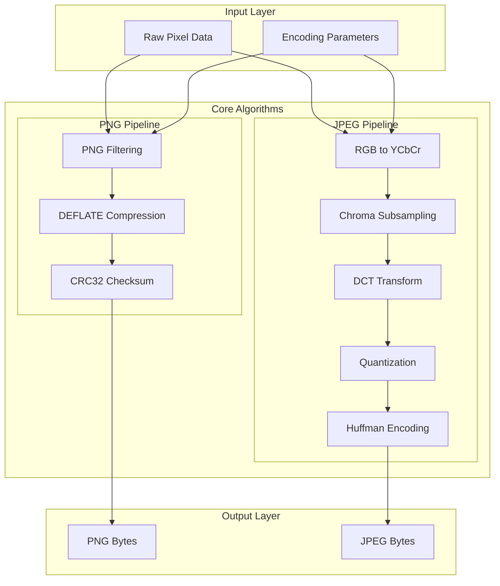

# Rust Image Compression Library (`comprs`)

## Architecture Overview



## Project Structure

```javascript
comprs/
├── Cargo.toml
├── src/
│   ├── lib.rs              # Public API
│   ├── error.rs            # Error types
│   ├── color.rs            # Color space conversions
│   ├── png/
│   │   ├── mod.rs          # PNG encoder
│   │   ├── filter.rs       # PNG filtering (None, Sub, Up, Average, Paeth)
│   │   └── chunk.rs        # PNG chunk formatting
│   ├── jpeg/
│   │   ├── mod.rs          # JPEG encoder
│   │   ├── dct.rs          # Discrete Cosine Transform
│   │   ├── quantize.rs     # Quantization tables
│   │   └── huffman.rs      # JPEG-specific Huffman coding
│   ├── compress/
│   │   ├── mod.rs
│   │   ├── deflate.rs      # DEFLATE algorithm (LZ77 + Huffman)
│   │   ├── lz77.rs         # LZ77 compression
│   │   ├── huffman.rs      # General Huffman coding
│   │   └── crc32.rs        # CRC32 checksum
│   └── bits.rs             # Bit-level I/O utilities
├── benches/
│   └── encode_benchmark.rs # Criterion benchmarks
└── tests/
    ├── png_conformance.rs  # PNG test suite integration
    └── jpeg_conformance.rs # JPEG test suite integration
```

## Implementation Phases

### Phase 1: Foundation and Core Utilities

- Set up Cargo project with minimal deps (only `criterion` for benchmarks)
- Implement bit-level writer for packed binary output
- Implement CRC32 (polynomial 0xEDB88320, table-based for speed)
- Create error types and public API skeleton

### Phase 2: PNG Encoder

**PNG Filtering** - Implement all 5 filter types:

- Type 0: None
- Type 1: Sub (difference from left pixel)
- Type 2: Up (difference from above pixel)
- Type 3: Average
- Type 4: Paeth predictor

**DEFLATE Compression** - Hand-implement from scratch:

- LZ77 with sliding window (32KB)
- Huffman tree construction
- Fixed and dynamic Huffman block encoding
- Lazy matching for better compression ratios

**PNG Chunk Assembly**:

- IHDR (image header)
- IDAT (compressed data, can be multiple chunks)
- IEND (end marker)
- Proper CRC32 for each chunk

### Phase 3: JPEG Encoder

**Color Space Conversion**:

```rust
Y  =  0.299*R + 0.587*G + 0.114*B
Cb = -0.169*R - 0.331*G + 0.500*B + 128
Cr =  0.500*R - 0.419*G - 0.081*B + 128
```

**DCT Transform** - Implement 8x8 2D DCT:

- Use separable 1D DCT for efficiency (O(n²) instead of O(n⁴))
- Consider AAN algorithm for further optimization later

**Quantization**:

- Standard JPEG luminance and chrominance tables
- Quality factor scaling

**Huffman/Entropy Encoding**:

- Zigzag scan ordering
- Run-length encode AC coefficients
- DPCM for DC coefficients
- Standard JPEG Huffman tables (or compute optimal)

**JFIF Container**:

- SOI, APP0 (JFIF), DQT, SOF0, DHT, SOS, EOI markers

### Phase 4: Optimizations

- SIMD intrinsics for DCT (using `std::arch` - no external crate needed)
- Parallel filter selection for PNG using `rayon` (optional feature)
- Memory pooling to reduce allocations
- Lookup tables for Huffman encoding

### Phase 5: Testing and Benchmarking

**PNG Conformance**:

- [PngSuite](http://www.schaik.com/pngsuite/) - Official PNG test images
- Roundtrip test: encode with `comprs`, decode with system `libpng`
- Bit-exact comparison where applicable

**JPEG Conformance**:

- [Independent JPEG Group test images](https://www.w3.org/Graphics/JPEG/itu-t81.pdf)
- [Kodak Lossless True Color Image Suite](http://r0k.us/graphics/kodak/) - Standard benchmark images
- PSNR/SSIM quality metrics comparison

**Benchmarks**:

- Compare against `image` crate, `libpng-sys`, `mozjpeg`
- Measure: encode time, output size, memory usage
- Use Criterion for statistical analysis

## Dependencies Strategy

**Required (build-time only)**:

- `criterion` - benchmarking (dev-dependency only)

**Optional features**:

- `simd` - Enable hand-written SIMD via `std::arch`
- `parallel` - Enable `rayon` for parallel filtering

**Zero runtime dependencies by default** - All algorithms implemented from scratch.

## Key Implementation Notes

1. **DEFLATE is the hardest part** - LZ77 with proper hash chains and Huffman coding requires careful implementation. Reference: RFC 1951.
2. **JPEG DCT precision matters** - Use fixed-point or careful floating-point to match reference implementations. The ITU-T T.83 test defines acceptable error bounds.
3. **Memory efficiency** - Process PNG in scanline chunks, JPEG in 8x8 MCU blocks to avoid loading entire image.
4. **Test early and often** - Each algorithm (CRC32, Huffman, LZ77, DCT) should have unit tests before integration.
