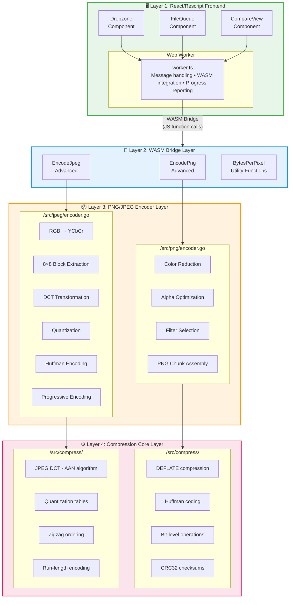
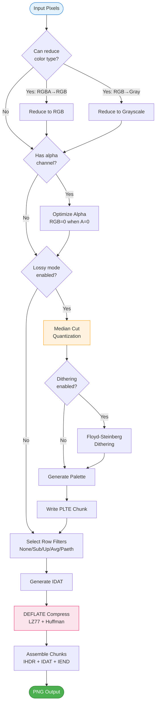
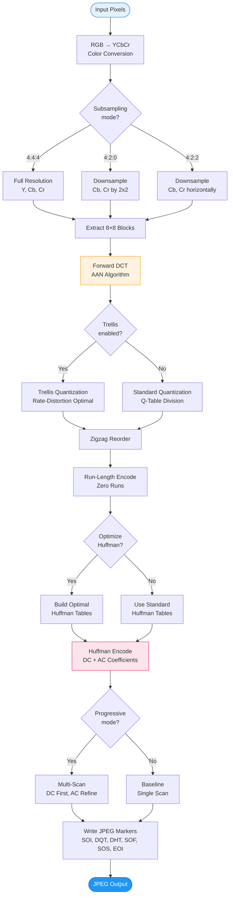
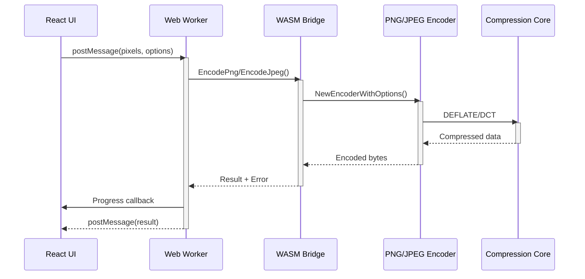
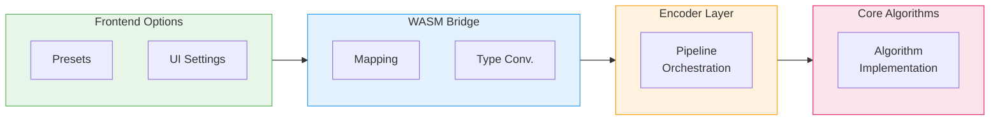
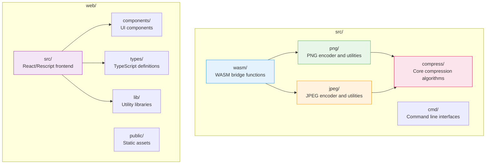

# Go-Pixo Architecture Documentation

This document provides a comprehensive guide to understanding and extending the go-pixo image compression system. It covers the complete architecture, compression pipelines, optimization strategies, and practical developer guidance.

## Table of Contents

1. [Architecture Overview](#architecture-overview)
2. [Current Compression Process](#current-compression-process)
3. [When Optimization Happens](#when-optimization-happens)
4. [Developer Guide](#developer-guide)

---

## Architecture Overview

Go-pixo implements a sophisticated 4-layer architecture that enables high-performance client-side image compression while maintaining a clean separation of concerns.

### System Architecture Diagram



### Component Descriptions

#### Layer 1: React/Rescript Frontend (`/web/src/`)

The frontend provides a modern, responsive user interface built with Rescript and React:

- **Dropzone Component**: Handles drag-and-drop file uploads with visual feedback
- **FileQueue Component**: Manages multiple file processing with status tracking
- **CompareView Component**: Displays before/after comparisons with metrics
- **State Management**: Uses React hooks and reducers for complex state management
- **Web Worker Integration**: Offloads compression to prevent UI blocking

**Key Files:**
- `App.res`: Main application component with state management
- `worker.ts`: Web Worker handling WASM communication
- `CompareView.res`: Image comparison component
- `FileQueue.res`: File management interface

#### Layer 2: WASM Bridge (`/src/wasm/`)

The WASM bridge provides seamless integration between JavaScript and Go:

- **Function Exposing**: Makes Go functions available to JavaScript
- **Type Conversion**: Handles data type marshalling between JS and Go
- **Error Handling**: Converts Go errors to JavaScript-friendly formats
- **Progress Reporting**: Supports callback-based progress updates

**Key Functions in `bridge.go`:**
```go
// PNG encoding with presets
func EncodePng(pixels []byte, width, height int, colorType, preset int, lossy bool, maxColors int) ([]byte, error)

// JPEG encoding with advanced options
func EncodeJpegAdvanced(pixels []byte, width, height int, colorType int, quality uint8, subsampling int, progressive bool, trellis bool, optimizeHuffman bool, preset int) ([]byte, error)

// PNG recompression for lossless optimization
func RecompressPngLossless(inputPNG []byte, preset int, zopfliIterations int, progressFunc func(string, int)) ([]byte, error)
```

#### Layer 3: PNG/JPEG Encoder Layer

This layer contains the high-level encoding logic:

**PNG Encoder (`/src/png/encoder.go`):**
- Orchestrates the complete PNG encoding pipeline
- Handles color type reduction and alpha optimization
- Manages filter selection strategies
- Assembles PNG chunks (IHDR, IDAT, IEND, etc.)

**JPEG Encoder (`/src/jpeg/encoder.go`):**
- Manages JPEG marker writing (SOI, DQT, DHT, SOS, EOI)
- Handles progressive vs baseline encoding
- Coordinates component encoding (Y, Cb, Cr)
- Implements MCU (Minimum Coded Unit) processing

#### Layer 4: Compression Core (`/src/compress/`)

The core algorithms and data structures:

- **DEFLATE Compression**: LZ77 + Huffman coding
- **JPEG DCT**: AAN fast discrete cosine transform
- **Bit-level Operations**: Efficient bit writing and manipulation
- **Huffman Tables**: Optimized coding table generation

### Key Architectural Patterns

1. **Clean Separation**: Each layer has distinct responsibilities with minimal coupling
2. **Options/Presets System**: Flexible configuration through structured option types
3. **Progressive Enhancement**: Advanced features build upon basic functionality
4. **Comprehensive Testing**: Extensive test coverage for reliability
5. **Performance-First**: Optimized algorithms with multiple strategy options

---

## Current Compression Process

### PNG Pipeline

The PNG encoding pipeline follows the official PNG specification while incorporating go-pixo optimizations:

#### Pipeline Flow


#### Detailed PNG Encoding Flow



#### Detailed PNG Pipeline Implementation

**1. Color Reduction and Analysis** (`encoder.go:124-139`)

```go
// Color Reduction (Lossless)
if opts.ReduceColorType {
    if CanReduceToRGB(processedPixels, opts.Width, opts.Height) {
        var err error
        processedPixels, colorType, err = ReduceToRGB(processedPixels, opts.Width, opts.Height)
        if err != nil {
            return nil, err
        }
    } else if CanReduceToGrayscale(processedPixels, opts.Width, opts.Height, colorType) {
        var err error
        processedPixels, colorType, err = ReduceToGrayscale(processedPixels, opts.Width, opts.Height, colorType)
        if err != nil {
            return nil, err
        }
    }
}
```

**2. Alpha Optimization** (`encoder.go:146-149`)

```go
// Alpha Optimization (RGB=0 when A=0)
if opts.OptimizeAlpha && colorType == ColorRGBA {
    processedPixels = OptimizeAlpha(processedPixels, colorType)
}
```

**3. Quantization Pipeline** (`encoder.go:73-122`)

```go
// Quantization (Lossy) - before other optimizations
if opts.MaxColors > 0 && opts.MaxColors < 256 {
    var indexedPixels []byte
    var palette Palette

    if opts.Dithering {
        indexedPixels, palette = QuantizeWithDithering(processedPixels, int(colorType), opts.MaxColors)
    } else {
        indexedPixels, palette = Quantize(processedPixels, int(colorType), opts.MaxColors)
    }
    // Write PLTE chunk with palette
    if err := WritePLTE(&buf, palette); err != nil {
        return nil, err
    }
}
```

**4. Filter Selection Strategy** (`filter_selector.go`)

The filter selection implements multiple strategies:

```go
func selectAdaptive(row []byte, prevRow []byte, bpp int) (FilterType, []byte) {
    return selectMinSum(row, prevRow, bpp)
}

func selectMinSum(row []byte, prevRow []byte, bpp int) (FilterType, []byte) {
    var bestFilter FilterType
    var bestFiltered []byte
    bestScore := -1

    filters := []struct {
        typ FilterType
        fn  func() []byte
    }{
        {FilterNone, func() []byte { return ApplyFilterNone(row) }},
        {FilterSub, func() []byte { return ApplyFilterSub(row, bpp) }},
        {FilterUp, func() []byte { return ApplyFilterUp(row, prevRow) }},
        {FilterAverage, func() []byte { return ApplyFilterAverage(row, prevRow, bpp) }},
        {FilterPaeth, func() []byte { return ApplyFilterPaeth(row, prevRow, bpp) }},
    }

    for _, f := range filters {
        filtered := f.fn()
        score := SumAbsoluteValues(filtered)
        if bestScore < 0 || score < bestScore {
            bestScore = score
            bestFilter = f.typ
            bestFiltered = filtered
        }
    }

    return bestFilter, bestFiltered
}
```

**5. Quantization Implementation** (`quantize.go`)

```go
func Quantize(pixels []byte, colorType int, maxColors int) ([]byte, Palette) {
    if maxColors <= 0 {
        maxColors = 256
    }
    if maxColors > 256 {
        maxColors = 256
    }

    colorMap := CountColors(pixels, colorType)
    colorsWithCount := ToColorWithCountSlice(colorMap)

    paletteColors := MedianCut(colorsWithCount, maxColors)

    palette := NewPalette(len(paletteColors))
    for _, c := range paletteColors {
        palette.AddColor(c)
    }

    bpp := BytesPerPixel(ColorType(colorType))
    width := len(pixels) / bpp

    indexed := make([]byte, width)

    for i := 0; i < width; i++ {
        offset := i * bpp
        c := Color{
            R: pixels[offset],
            G: pixels[offset+1],
            B: pixels[offset+2],
        }
        indexed[i] = uint8(palette.FindNearest(c))
    }

    return indexed, *palette
}
```

### JPEG Pipeline

The JPEG encoding pipeline follows the JPEG standard with go-pixo optimizations:

#### Pipeline Flow


#### Detailed JPEG Encoding Flow



#### Detailed JPEG Pipeline Implementation

**1. Color Space Conversion** (`blocks.go`)

```go
func ExtractBlock(pixels []byte, width, height int, x, y int, colorType ColorType) ([8]float32, [8]float32, [8]float32) {
    // Extract 8x8 Y block
    var yBlock [8]float32
    for row := 0; row < 8; row++ {
        for col := 0; col < 8; col++ {
            idx := ((y + row) * width + (x + col)) * 3
            if colorType == ColorRGB {
                r := float32(pixels[idx])
                g := float32(pixels[idx+1])
                b := float32(pixels[idx+2])
                yBlock[row*8+col] = 0.299*r + 0.587*g + 0.114*b
            } else {
                yBlock[row*8+col] = float32(pixels[idx])
            }
        }
    }
    // ... extract Cb, Cr blocks similarly
    return yBlock, cbBlock, crBlock
}
```

**2. DCT Transformation** (`dct.go:29-59`)

```go
func ForwardDCT(block [64]float32) [64]float32 {
    var temp [64]float32
    var result [64]float32

    // 1D DCT on rows
    for row := 0; row < 8; row++ {
        rowStart := row * 8
        rowData := [8]float32{
            block[rowStart], block[rowStart+1], block[rowStart+2], block[rowStart+3],
            block[rowStart+4], block[rowStart+5], block[rowStart+6], block[rowStart+7],
        }
        aanDCT1D(&rowData)
        for i := 0; i < 8; i++ {
            temp[rowStart+i] = rowData[i]
        }
    }

    // 1D DCT on columns
    for col := 0; col < 8; col++ {
        var colData [8]float32
        for row := 0; row < 8; row++ {
            colData[row] = temp[row*8+col]
        }
        aanDCT1D(&colData)
        for row := 0; row < 8; row++ {
            result[row*8+col] = colData[row]
        }
    }

    return result
}
```

**3. Quantization** (`encoder.go:371-390`)

```go
func (e *Encoder) quantizeBlock(block [64]float32, isLuminance bool, qt *QuantizationTables) [64]int16 {
    dct := ForwardDCT(block)
    var qTable [64]float32
    if isLuminance {
        qTable = qt.Luminance
    } else {
        qTable = qt.Chrominance
    }

    // Use trellis quantization if enabled
    if e.Options.TrellisQuant {
        lambda := CalculateLambda(e.Options.Quality)
        quantized := TrellisQuantize(dct, qTable, lambda)
        return ZigzagReorder(quantized)
    }

    // Standard quantization
    quantized := QuantizeBlock(dct, qTable)
    return ZigzagReorder(quantized)
}
```

**4. Huffman Encoding** (`encoder.go:394-427`)

```go
func (e *Encoder) encodeComponentBlock(bw *BitWriter, block [64]float32, prevDC int16, isLuminance bool, ht *HuffmanTables, qt *QuantizationTables) (int16, error) {
    // 1. Quantize and Zigzag
    zigzag := e.quantizeBlock(block, isLuminance, qt)

    // 2. Huffman Encode DC
    dc := zigzag[0]
    cat, bits, bitLen := EncodeDC(dc, prevDC)
    hCode, hLen := ht.EncodeDC(cat, isLuminance)
    if err := bw.Write(uint32(hCode), hLen); err != nil {
        return 0, err
    }
    if bitLen > 0 {
        if err := bw.Write(uint32(bits), bitLen); err != nil {
            return 0, err
        }
    }

    // 3. Huffman Encode AC
    acRuns := RunLengthEncode(zigzag)
    for _, run := range acRuns {
        hCode, hLen := ht.EncodeAC(run.RunLength, run.Size, isLuminance)
        if err := bw.Write(uint32(hCode), hLen); err != nil {
            return 0, err
        }
        if run.Size > 0 {
            bits, bitLen := EncodeValue(run.Value)
            if err := bw.Write(uint32(bits), bitLen); err != nil {
                return 0, err
            }
        }
    }

    return dc, nil
}
```

### WASM Bridge Integration

The WASM bridge in `bridge.go` demonstrates how the frontend interfaces with the Go backend:

#### Communication Flow



```go
/**
 * EncodePng encodes pixels as a PNG image using the go-pixo PNG encoder.
 * Returns PNG file bytes ready to be written to a file or used in a browser.
 */
func EncodePng(pixels []byte, width, height int, colorType, preset int, lossy bool, maxColors int) ([]byte, error) {
    var pngColorType png.ColorType
    switch colorType {
    case 0:
        pngColorType = png.ColorGrayscale
    case 2:
        pngColorType = png.ColorRGB
    case 6:
        pngColorType = png.ColorRGBA
    default:
        return nil, fmt.Errorf("unsupported color type: %d", colorType)
    }

    // Map ReScript presets to Go options
    var opts png.Options
    switch preset {
    case 0: // Smaller - Maximum compression
        opts = png.SmallerOptions(width, height)
    case 1: // Balanced
        opts = png.BalancedOptions(width, height)
    case 2: // Faster - Fast with size guarantee
        opts = png.FasterOptions(width, height)
    default:
        opts = png.BalancedOptions(width, height)
    }
    opts.ColorType = pngColorType

    // Apply lossy quantization if enabled
    if lossy && maxColors > 0 && maxColors <= 256 {
        opts.ApplyLossy(maxColors, 75, 0.5)
        opts.ColorType = png.ColorIndexed
    }

    encoder, err := png.NewEncoderWithOptions(opts)
    if err != nil {
        return nil, fmt.Errorf("failed to create encoder: %w", err)
    }

    pngBytes, err := encoder.Encode(pixels)
    if err != nil {
        return nil, fmt.Errorf("failed to encode PNG: %w", err)
    }

    return pngBytes, nil
}
```

---

## When Optimization Happens

### Integration Points Overview

Optimizations in go-pixo are strategically placed throughout the compression pipelines to maximize effectiveness while maintaining code clarity and performance.



### Priority 1 Optimizations (High Impact, Low Complexity)

These optimizations provide the best performance-to-complexity ratio and should be implemented first.

#### 1. Palette LUT (Look-Up Table)

**Integration Point**: PNG quantization pipeline (`quantize.go:28-38`)

**Current Implementation**:
```go
for i := 0; i < width; i++ {
    offset := i * bpp
    c := Color{
        R: pixels[offset],
        G: pixels[offset+1],
        B: pixels[offset+2],
    }
    indexed[i] = uint8(palette.FindNearest(c))
}
```

**Optimization Enhancement**:
```go
// Create LUT for faster palette lookups
type PaletteLUT struct {
    lut [256][256][256]uint8  // RGB → palette index
    valid bool
}

func NewPaletteLUT(palette *Palette) *PaletteLUT {
    lut := &PaletteLUT{valid: true}
    
    // Precompute RGB combinations to palette indices
    for r := 0; r < 256; r++ {
        for g := 0; g < 256; g++ {
            for b := 0; b < 256; b++ {
                target := Color{R: uint8(r), G: uint8(g), B: uint8(b)}
                lut.lut[r][g][b] = uint8(palette.FindNearest(target))
            }
        }
    }
    return lut
}

func (lut *PaletteLUT) FindNearestIndex(r, g, b uint8) uint8 {
    return lut.lut[r][g][b]
}
```

**Usage in Pipeline**:
```go
func QuantizeWithLUT(pixels []byte, colorType int, maxColors int) ([]byte, Palette) {
    // ... existing quantization logic ...
    
    // Create LUT once
    lut := NewPaletteLUT(&palette)
    
    // Use LUT for fast lookups
    indexed := make([]byte, width)
    for i := 0; i < width; i++ {
        offset := i * bpp
        indexed[i] = lut.FindNearestIndex(pixels[offset], pixels[offset+1], pixels[offset+2])
    }
    
    return indexed, palette
}
```

#### 2. K-means Refinement

**Integration Point**: PNG color reduction (`quantize.go:5-39`)

**Enhancement to Existing MedianCut**:
```go
func KMeansRefinement(colors []ColorWithCount, maxColors int) []Color {
    // Initialize with median cut results
    centroids := MedianCut(colors, maxColors)
    
    // Iterative refinement
    for iter := 0; iter < 10; iter++ {  // Max 10 iterations
        // Assign colors to nearest centroid
        assignments := make([][]ColorWithCount, len(centroids))
        for _, color := range colors {
            nearest := 0
            minDist := EuclideanDistanceSquared(color.Color, centroids[0])
            
            for i, centroid := range centroids {
                dist := EuclideanDistanceSquared(color.Color, centroid)
                if dist < minDist {
                    minDist = dist
                    nearest = i
                }
            }
            assignments[nearest] = append(assignments[nearest], color)
        }
        
        // Update centroids
        changed := false
        for i, cluster := range assignments {
            if len(cluster) > 0 {
                newCentroid := CalculateClusterCentroid(cluster)
                if EuclideanDistanceSquared(newCentroid, centroids[i]) > 1.0 {
                    changed = true
                }
                centroids[i] = newCentroid
            }
        }
        
        if !changed {
            break  // Converged
        }
    }
    
    return centroids
}
```

#### 3. Bigrams Filter

**Integration Point**: PNG filter selection (`filter_selector.go`)

**Enhancement**:
```go
// Analyze pixel patterns for better filter selection
type BigramsFilter struct {
    patterns map[string]float64
    entropy  float64
}

func BuildBigramsFilter(pixels []byte, width, height, bpp int) *BigramsFilter {
    bf := &BigramsFilter{patterns: make(map[string]float64)}
    
    // Count 2-pixel patterns (bigrams)
    for y := 0; y < height; y++ {
        for x := 0; x < width-1; x++ {
            offset := (y*width + x) * bpp
            pattern := fmt.Sprintf("%d,%d,%d;%d,%d,%d",
                pixels[offset], pixels[offset+1], pixels[offset+2],
                pixels[offset+bpp], pixels[offset+bpp+1], pixels[offset+bpp+2])
            bf.patterns[pattern]++
        }
    }
    
    // Calculate entropy
    total := float64(width * height)
    for _, count := range bf.patterns {
        prob := count / total
        bf.entropy -= prob * math.Log2(prob)
    }
    
    return bf
}

func (bf *BigramsFilter) SelectFilter(row []byte, prevRow []byte, bpp int) (FilterType, []byte) {
    // Use bigrams analysis for better filter choice
    if bf.entropy > 7.0 {
        // High entropy: use Paeth (good for noisy data)
        return FilterPaeth, ApplyFilterPaeth(row, prevRow, bpp)
    } else if bf.entropy < 4.0 {
        // Low entropy: use Up (good for smooth gradients)
        return FilterUp, ApplyFilterUp(row, prevRow)
    } else {
        // Medium entropy: use adaptive selection
        return selectAdaptive(row, prevRow, bpp)
    }
}
```

#### 4. SIMD DCT

**Integration Point**: JPEG DCT computation (`dct.go:62-108`)

**SIMD Enhancement**:
```go
//go:build amd64 || arm64
// +build amd64 arm64

package jpeg

import "github.com/minio/asm2plan9as/asm"

// AAN DCT with SIMD optimizations for AMD64
func aanDCT1DSIMD(data *[8]float32) {
    // Inline assembly for performance-critical DCT operations
    asmCode := `
    movups (%rdi), %xmm0           // Load 8 floats
    movups 16(%rdi), %xmm1
    // ... SIMD optimized DCT computation ...
    movups %xmm0, (%rdi)           // Store results
    `
    // Use SIMD instructions for parallel computation
    // This would require careful assembly implementation
}
```

#### 5. Huffman Caching

**Integration Point**: JPEG Huffman encoding (`encoder.go:398-427`)

**Caching Enhancement**:
```go
type HuffmanCache struct {
    dcCache map[DCKey]string // (category, isLuminance) → code
    acCache map[ACKey]string // (runLength, size, isLuminance) → code
    dcBits  map[DCKey]uint32 // (category, isLuminance) → bits
    acBits  map[ACKey]uint32 // (runLength, size, isLuminance) → bits
}

type DCKey struct {
    Category      int
    IsLuminance  bool
}

type ACKey struct {
    RunLength    int
    Size         int
    IsLuminance  bool
}

func NewHuffmanCache() *HuffmanCache {
    return &HuffmanCache{
        dcCache: make(map[DCKey]string),
        acCache: make(map[ACKey]string),
        dcBits:  make(map[DCKey]uint32),
        acBits:  make(map[ACKey]uint32),
    }
}

func (cache *HuffmanCache) EncodeDC(cat int, isLuminance bool, ht *HuffmanTables) (string, uint32, int) {
    key := DCKey{Category: cat, IsLuminance: isLuminance}
    
    if code, exists := cache.dcCache[key]; exists {
        bits := cache.dcBits[key]
        return code, bits, len(code)
    }
    
    hCode, hLen := ht.EncodeDC(cat, isLuminance)
    code := fmt.Sprintf("%0*b", hLen, hCode)
    
    cache.dcCache[key] = code
    cache.dcBits[key] = hCode
    
    return code, hCode, hLen
}
```

### Priority 2 Optimizations (Medium Impact, Medium Complexity)

#### 1. Parallel Processing

**Integration Point**: Multi-block JPEG encoding (`encoder.go:120-203`)

```go
func (e *Encoder) encodeBaselineParallel(buf *bytes.Buffer, pixels []byte, ht *HuffmanTables, qt *QuantizationTables) ([]byte, error) {
    bw := NewBitWriter(buf)
    
    // Write SOS
    if err := WriteSOS(buf, e.Options.ColorType); err != nil {
        return nil, err
    }
    
    // Create worker pool for parallel block encoding
    numWorkers := runtime.NumCPU()
    blockChan := make(chan MCUBlock, numWorkers*2)
    resultChan := make(chan EncodedBlock, numWorkers*2)
    
    // Start workers
    for i := 0; i < numWorkers; i++ {
        go e.worker(blockChan, resultChan, ht, qt)
    }
    
    // Process blocks in parallel
    if e.Options.Subsampling == Subsampling420 && e.Options.ColorType == ColorRGB {
        // 4:2:0 encoding loop (16x16 MCUs)
        for y := 0; y < e.Options.Height; y += 16 {
            for x := 0; x < e.Options.Width; x += 16 {
                yBlocks, cbBlock, crBlock := ExtractMCU420(pixels, e.Options.Width, e.Options.Height, x, y)
                
                blockChan <- MCUBlock{
                    YBlocks:  yBlocks,
                    CbBlock: cbBlock,
                    CrBlock: crBlock,
                    Pos:     struct{X, Y int}{x, y},
                }
            }
        }
    }
    
    // Collect results and write in order
    close(blockChan)
    
    results := make([]EncodedBlock, 0, (e.Options.Width/8)*(e.Options.Height/8))
    for range resultChan {
        results = append(results, <-resultChan)
    }
    
    // Sort by position and write
    sort.Slice(results, func(i, j int) bool {
        if results[i].Pos.Y == results[j].Pos.Y {
            return results[i].Pos.X < results[j].Pos.X
        }
        return results[i].Pos.Y < results[j].Pos.Y
    })
    
    for _, result := range results {
        if _, err := bw.Write(result.Data, result.BitLen); err != nil {
            return nil, err
        }
    }
    
    // Flush and write EOI
    if err := bw.Flush(); err != nil {
        return nil, err
    }
    
    if err := WriteEOI(buf); err != nil {
        return nil, err
    }
    
    return buf.Bytes(), nil
}
```

#### 2. Full Trellis Quantization

**Integration Point**: JPEG quantization optimization (`encoder.go:371-390`)

```go
func TrellisQuantizeFull(dct [64]float32, qTable [64]float32, lambda float64) [64]int16 {
    // Dynamic programming approach for optimal quantization
    // This is a simplified version - full implementation would be more complex
    
    var result [64]int16
    
    // For each coefficient, try different quantization levels
    for i := 0; i < 64; i++ {
        if i == 0 { // DC coefficient
            // DC gets special treatment
            rounded := int16(math.Round(dct[i] / qTable[i]))
            if rounded < -2048 { rounded = -2048 }
            if rounded > 2047 { rounded = 2047 }
            result[i] = rounded
        } else { // AC coefficients
            // Use rate-distortion optimization
            bestVal := int16(0)
            bestCost := float64(1<<60)
            
            for qLevel := -128; qLevel <= 128; qLevel++ {
                quantized := int16(qLevel)
                if quantized == 0 {
                    cost := lambda // Cost of coding zero
                } else {
                    coeff := float64(quantized) * qTable[i]
                    distortion := (dct[i] - coeff) * (dct[i] - coeff)
                    rate := math.Log2(float64(abs(quantized)) + 1)
                    cost := distortion + lambda*rate
                    
                    if cost < bestCost {
                        bestCost = cost
                        bestVal = quantized
                    }
                }
            }
            
            result[i] = bestVal
        }
    }
    
    return result
}
```

### Priority 3 Optimizations (Lower Impact, High Complexity)

#### 1. Scratch Buffers

**Integration Point**: Memory management for large images

```go
type ScratchBufferPool struct {
    pixelBuffers   sync.Pool // For pixel data
    blockBuffers   sync.Pool // For 8x8 blocks
    dctBuffers     sync.Pool // For DCT coefficients
    huffmanBuffers sync.Pool // For Huffman coding
}

func NewScratchBufferPool() *ScratchBufferPool {
    return &ScratchBufferPool{
        pixelBuffers: sync.Pool{
            New: func() interface{} {
                return make([]byte, 0, 1024*1024) // 1MB buffer
            },
        },
        blockBuffers: sync.Pool{
            New: func() interface{} {
                return make([][64]float32, 0)
            },
        },
        // ... other pools
    }
}

func (pool *ScratchBufferPool) GetPixelBuffer(size int) []byte {
    buf := pool.pixelBuffers.Get().([]byte)
    if cap(buf) < size {
        pool.pixelBuffers.Put(buf)
        return make([]byte, size)
    }
    return buf[:size]
}

func (pool *ScratchBufferPool) PutPixelBuffer(buf []byte) {
    pool.pixelBuffers.Put(buf)
}
```

#### 2. Early Termination

**Integration Point**: Filter selection and quantization

```go
func SelectFilterEarlyExit(row []byte, prevRow []byte, bpp int, timeBudget time.Duration) (FilterType, []byte) {
    start := time.Now()
    var bestFilter FilterType
    var bestFiltered []byte
    bestScore := -1
    
    filters := []struct {
        typ FilterType
        fn  func() []byte
    }{
        {FilterNone, func() []byte { return ApplyFilterNone(row) }},
        {FilterSub, func() []byte { return ApplyFilterSub(row, bpp) }},
        {FilterUp, func() []byte { return ApplyFilterUp(row, prevRow) }},
        {FilterAverage, func() []byte { return ApplyFilterAverage(row, prevRow, bpp) }},
        {FilterPaeth, func() []byte { return ApplyFilterPaeth(row, prevRow, bpp) }},
    }
    
    for _, f := range filters {
        // Check time budget
        if time.Since(start) > timeBudget {
            // Use best found so far
            break
        }
        
        filtered := f.fn()
        score := SumAbsoluteValues(filtered)
        
        // Early exit if perfect score found
        if score == 0 {
            return f.typ, filtered
        }
        
        if bestScore < 0 || score < bestScore {
            bestScore = score
            bestFilter = f.typ
            bestFiltered = filtered
        }
    }
    
    return bestFilter, bestFiltered
}
```

---

## Developer Guide

### Adding New Features

This section provides step-by-step guidance for extending go-pixo with new functionality.

#### Step 1: Understanding the Codebase Structure

**Package Organization**:



```
src/
├── compress/          # Core compression algorithms
├── png/              # PNG encoder and utilities
├── jpeg/             # JPEG encoder and utilities
├── wasm/             # WASM bridge functions
└── cmd/              # Command line interfaces
web/
├── src/              # React/Rescript frontend
│   ├── components/  # UI components
│   ├── types/       # TypeScript type definitions
│   └── lib/         # Utility libraries
└── public/          # Static assets
```

**Key Files by Function**:

| Function | Primary Files | Key Functions |
|----------|---------------|---------------|
| PNG Encoding | `src/png/encoder.go` | `Encode()`, `NewEncoderWithOptions()` |
| JPEG Encoding | `src/jpeg/encoder.go` | `Encode()`, `encodeBaseline()` |
| DCT Transform | `src/jpeg/dct.go` | `ForwardDCT()`, `InverseDCT()` |
| PNG Quantization | `src/png/quantize.go` | `Quantize()`, `QuantizeWithDithering()` |
| Filter Selection | `src/png/filter_selector.go` | `SelectFilter()`, `selectAdaptive()` |
| WASM Bridge | `src/wasm/bridge.go` | `EncodePng()`, `EncodeJpegAdvanced()` |

#### Step 2: Adding a New PNG Optimization

Let's walk through adding a new PNG optimization: **Adaptive Color Reduction**.

**1. Implement the Core Algorithm**

Create a new file `src/png/adaptive_reduce.go`:

```go
package png

import "math"

// AdaptiveColorReducer analyzes image content to determine optimal color reduction strategy
type AdaptiveColorReducer struct {
    gradientMap    map[GradientKey]float64
    complexityMap  map[ComplexityKey]float64
}

// GradientKey represents a gradient pattern
type GradientKey struct {
    Direction GradientDirection
    Strength float64
}

// ComplexityKey represents image complexity metrics
type ComplexityKey struct {
    LocalVariance  float64
    EdgeDensity    float64
}

type GradientDirection int

const (
    Horizontal GradientDirection = iota
    Vertical
    Diagonal45
    Diagonal135
)

func NewAdaptiveColorReducer() *AdaptiveColorReducer {
    return &AdaptiveColorReducer{
        gradientMap:   make(map[GradientKey]float64),
        complexityMap: make(map[ComplexityKey]float64),
    }
}

// AnalyzeImageContent analyzes the image to determine optimal reduction strategy
func (acr *AdaptiveColorReducer) AnalyzeImageContent(pixels []byte, width, height, bpp int) ReductionStrategy {
    // Calculate gradient patterns
    gradients := acr.calculateGradients(pixels, width, height, bpp)
    
    // Calculate complexity metrics
    complexity := acr.calculateComplexity(pixels, width, height, bpp)
    
    // Determine optimal strategy
    return acr.determineStrategy(gradients, complexity)
}

func (acr *AdaptiveColorReducer) calculateGradients(pixels []byte, width, height, bpp int) []GradientStrength {
    var gradients []GradientStrength
    
    for y := 0; y < height-1; y++ {
        for x := 0; x < width-1; x++ {
            current := getPixel(pixels, x, y, bpp, width)
            right := getPixel(pixels, x+1, y, bpp, width)
            below := getPixel(pixels, x, y+1, bpp, width)
            
            // Calculate horizontal gradient
            hGradient := math.Abs(float64(right.R) - float64(current.R)) +
                        math.Abs(float64(right.G) - float64(current.G)) +
                        math.Abs(float64(right.B) - float64(current.B))
            
            // Calculate vertical gradient
            vGradient := math.Abs(float64(below.R) - float64(current.R)) +
                        math.Abs(float64(below.G) - float64(current.G)) +
                        math.Abs(float64(below.B) - float64(current.B))
            
            gradients = append(gradients, GradientStrength{
                Horizontal: hGradient,
                Vertical:   vGradient,
                Position:   Point{X: x, Y: y},
            })
        }
    }
    
    return gradients
}

func (acr *AdaptiveColorReducer) determineStrategy(gradients []GradientStrength, complexity ComplexityMetrics) ReductionStrategy {
    // Simple heuristic: high complexity → preserve colors, low complexity → aggressive reduction
    
    avgGradient := 0.0
    for _, g := range gradients {
        avgGradient += g.Horizontal + g.Vertical
    }
    avgGradient /= float64(len(gradients))
    
    if complexity.LocalVariance > 1000 && avgGradient > 50 {
        // High detail image → minimal reduction
        return ReductionStrategy{
            MaxColors:     200,
            PreserveDetail: true,
            Dithering:     true,
        }
    } else if complexity.LocalVariance < 100 && avgGradient < 20 {
        // Smooth gradients → aggressive reduction
        return ReductionStrategy{
            MaxColors:     32,
            PreserveDetail: false,
            Dithering:     false,
        }
    } else {
        // Balanced approach
        return ReductionStrategy{
            MaxColors:     64,
            PreserveDetail: true,
            Dithering:     true,
        }
    }
}

// ReductionStrategy defines how to reduce colors
type ReductionStrategy struct {
    MaxColors      int
    PreserveDetail bool
    Dithering      bool
}

// GradientStrength represents gradient strength in different directions
type GradientStrength struct {
    Horizontal float64
    Vertical   float64
    Position   Point
}

// ComplexityMetrics represents image complexity measures
type ComplexityMetrics struct {
    LocalVariance float64
    EdgeDensity   float64
}

type Point struct {
    X, Y int
}

// Helper function to get pixel value
func getPixel(pixels []byte, x, y, bpp, width int) Color {
    offset := (y*width + x) * bpp
    return Color{
        R: pixels[offset],
        G: pixels[offset+1],
        B: pixels[offset+2],
    }
}
```

**2. Integrate with PNG Encoder**

Modify `src/png/encoder.go` to use the new adaptive reduction:

```go
// In EncodeWithOptions function, add before quantization
if opts.AdaptiveColorReduction {
    reducer := NewAdaptiveColorReducer()
    strategy := reducer.AnalyzeImageContent(processedPixels, opts.Width, opts.Height, bpp)
    
    if strategy.MaxColors < opts.MaxColors {
        opts.MaxColors = strategy.MaxColors
        opts.Dithering = strategy.Dithering
        opts.QualityTarget = mapMaxColorsToQuality(strategy.MaxColors)
    }
}
```

**3. Update Options System**

Add to `src/png/options.go`:

```go
// In Options struct
type Options struct {
    // ... existing fields ...
    AdaptiveColorReduction bool
}

// Update preset functions to enable adaptive reduction
func SmallerOptions(width, height int) Options {
    return Options{
        // ... existing options ...
        AdaptiveColorReduction: true,
    }
}
```

**4. Expose Through WASM Bridge**

Modify `src/wasm/bridge.go`:

```go
func EncodePngAdvanced(pixels []byte, width, height int, colorType, preset int, lossy bool, maxColors int, dithering bool, ditherStrength float64, qualityTarget int, zopfliIterations int, progressFunc func(string, int), adaptiveReduction bool) ([]byte, error) {
    // ... existing code ...
    
    opts.AdaptiveColorReduction = adaptiveReduction
    
    // ... rest of function ...
}
```

**5. Update Frontend Integration**

Modify `web/src/worker.ts`:

```typescript
interface CompressionRequest {
  // ... existing fields ...
  adaptiveReduction?: boolean;
}

function encodePngAdvanced(
  pixels: Uint8Array,
  width: number,
  height: number,
  colorType: number = 6,
  preset: number = 1,
  lossy: boolean = false,
  maxColors: number = 0,
  dithering: boolean = false,
  ditherStrength: number = 0.5,
  qualityTarget: number = 75,
  zopfliIterations: number = 0,
  adaptiveReduction: boolean = false,
  onProgress?: (phase: string, progress: number) => void,
): Uint8Array {
  // ... existing validation ...
  
  const result = (self as any).encodePngAdvanced(
    pixels,
    width,
    height,
    colorType,
    preset,
    lossy,
    maxColors,
    dithering,
    ditherStrength,
    qualityTarget,
    zopfliIterations,
    onProgress,
    adaptiveReduction,
  );
  
  return result as Uint8Array;
}
```

**6. Add Frontend UI Component**

Create `web/src/components/AdaptiveReduction.res`:

```rescript
@react.component
let make = (~enabled, ~onChange) => {
  <div className="flex items-center space-x-2">
    <input
      type_="checkbox"
      id="adaptive-reduction"
      checked={enabled}
      onChange={_ => onChange(!enabled)}
      className="rounded border-gray-300 text-blue-600 focus:ring-blue-500"
    />
    <label htmlFor="adaptive-reduction" className="text-sm font-medium text-gray-700">
      {React.string("Smart Color Reduction")}
    </label>
    <span className="text-xs text-gray-500">
      {React.string("Automatically optimize colors based on image content")}
    </span>
  </div>
}
```

#### Step 3: Adding a New JPEG Feature

Let's add **Progressive JPEG with Quality Layers**.

**1. Implement Quality Layer System**

Create `src/jpeg/progressive_layers.go`:

```go
package jpeg

import "math"

// QualityLayer represents a progressive encoding layer
type QualityLayer struct {
    LayerID      int
    Quality      uint8
    ComponentIDs []uint8 // 1=Y, 2=Cb, 3=Cr
    ScanType     ScanType
}

// ScanType defines the type of progressive scan
type ScanType int

const (
    DCFirst    ScanType = iota // DC coefficients first
    ACFirst                // AC coefficients first
    DCOnly                  // DC only
    ACOnly                  // AC only
)

// ProgressiveQualityLayer manages progressive encoding with quality layers
type ProgressiveQualityLayer struct {
    layers    []QualityLayer
    thresholds map[int][]float64 // layer → quality thresholds
}

func NewProgressiveQualityLayer() *ProgressiveQualityLayer {
    return &ProgressiveQualityLayer{
        layers: []QualityLayer{
            {
                LayerID:      0,
                Quality:      30,
                ComponentIDs: []uint8{1}, // Y only
                ScanType:     DCFirst,
            },
            {
                LayerID:      1,
                Quality:      60,
                ComponentIDs: []uint8{1, 2, 3}, // All components
                ScanType:     ACFirst,
            },
            {
                LayerID:      2,
                Quality:      85,
                ComponentIDs: []uint8{1, 2, 3}, // All components
                ScanType:     ACOnly,
            },
        },
        thresholds: make(map[int][]float64),
    }
}

// GenerateLayers creates optimized progressive layers for an image
func (pql *ProgressiveQualityLayer) GenerateLayers(imageMetrics ImageMetrics) []QualityLayer {
    var optimizedLayers []QualityLayer
    
    // Analyze image content to determine optimal layer configuration
    if imageMetrics.HasFineDetail {
        // Add more layers for images with fine details
        optimizedLayers = append(optimizedLayers, QualityLayer{
            LayerID:      0,
            Quality:      20,
            ComponentIDs: []uint8{1},
            ScanType:     DCFirst,
        })
    }
    
    // Base progressive layers
    for _, layer := range pql.layers {
        optimizedLayers = append(optimizedLayers, layer)
    }
    
    return optimizedLayers
}

// ImageMetrics contains image analysis results
type ImageMetrics struct {
    HasFineDetail    bool
    ColorComplexity  float64
    LuminanceRange  float64
    EstimatedSize   int
}
```

**2. Modify JPEG Encoder**

Update `src/jpeg/encoder.go`:

```go
// Add to Encoder struct
type Encoder struct {
    Options              Options
    ProgressiveLayers    *ProgressiveQualityLayer
    ImageMetrics         ImageMetrics
}

// Modify NewEncoder to accept progressive layers
func NewEncoderWithProgressive(opts Options, layers *ProgressiveQualityLayer) (*Encoder, error) {
    encoder := &Encoder{
        Options:           opts,
        ProgressiveLayers: layers,
    }
    
    // Analyze image metrics if using progressive encoding
    if opts.Progressive {
        encoder.ImageMetrics = AnalyzeImageForProgressive(opts)
    }
    
    return encoder, nil
}

// New progressive encoding method
func (e *Encoder) encodeProgressiveWithLayers(buf *bytes.Buffer, pixels []byte, ht *HuffmanTables, qt *QuantizationTables) ([]byte, error) {
    // Generate optimized layers based on image content
    layers := e.ProgressiveLayers.GenerateLayers(e.ImageMetrics)
    
    // Write JPEG headers
    if err := WriteSOI(buf); err != nil {
        return nil, err
    }
    
    // Write quantization tables for each layer
    for _, layer := range layers {
        layerQT := qt.CloneWithQuality(layer.Quality)
        if err := WriteDQT(buf, layer.LayerID, layerQT.LuminanceTable); err != nil {
            return nil, err
        }
    }
    
    // Write progressive frame header
    if err := WriteSOF2(buf, uint16(e.Options.Width), uint16(e.Options.Height), e.Options.ColorType, e.Options.Subsampling); err != nil {
        return nil, err
    }
    
    // Encode with progressive layers
    for _, layer := range layers {
        if err := e.encodeLayer(buf, pixels, ht, qt, layer); err != nil {
            return nil, err
        }
    }
    
    // Write EOI
    if err := WriteEOI(buf); err != nil {
        return nil, err
    }
    
    return buf.Bytes(), nil
}

func (e *Encoder) encodeLayer(buf *bytes.Buffer, pixels []byte, ht *HuffmanTables, qt *QuantizationTables, layer QualityLayer) error {
    // Create scan header for this layer
    scan := CreateScanForLayer(layer)
    if err := WriteSOSProgressive(buf, scan, e.Options.ColorType); err != nil {
        return err
    }
    
    // Encode coefficients for this layer only
    bw := NewBitWriter(buf)
    
    // Process blocks with layer-specific filtering
    switch layer.ScanType {
    case DCFirst:
        return e.encodeDCFirst(buf, pixels, ht, qt, layer)
    case ACFirst:
        return e.encodeACFirst(buf, pixels, ht, qt, layer)
    default:
        return e.encodeStandardLayer(buf, pixels, ht, qt, layer)
    }
}
```

#### Step 4: Adding a New Compression Algorithm

Let's add **WebP-style compression** as an example.

**1. Create WebP Encoder Structure**

Create `src/webp/` directory and `src/webp/encoder.go`:

```go
package webp

import "bytes"

// WebPEncoder implements WebP compression
type WebPEncoder struct {
    Options WebPOptions
}

// WebPOptions contains WebP-specific compression settings
type WebPOptions struct {
    Width         int
    Height        int
    Quality       uint8
    Method        uint8 // 0-6, compression method
    FilterStrength uint8 // 0-100
    AutoFilter    bool
}

// NewWebPEncoder creates a new WebP encoder
func NewWebPEncoder(opts WebPOptions) *WebPEncoder {
    return &WebPEncoder{
        Options: opts,
    }
}

// Encode encodes pixels as WebP
func (e *WebPEncoder) Encode(pixels []byte) ([]byte, error) {
    buf := new(bytes.Buffer)
    
    // Write RIFF container header
    if err := e.writeRIFFHeader(buf); err != nil {
        return nil, err
    }
    
    // Write VP8 frame
    if err := e.encodeVP8Frame(buf, pixels); err != nil {
        return nil, err
    }
    
    // Write RIFF footer
    if err := e.writeRIFFFooter(buf); err != nil {
        return nil, err
    }
    
    return buf.Bytes(), nil
}

func (e *WebPEncoder) writeRIFFHeader(buf *bytes.Buffer) error {
    // RIFF header: "RIFF" + size + "WEBP"
    if _, err := buf.WriteString("RIFF"); err != nil {
        return err
    }
    // Size will be filled later
    buf.Write(make([]byte, 4))
    if _, err := buf.WriteString("WEBP"); err != nil {
        return err
    }
    return nil
}

func (e *WebPEncoder) encodeVP8Frame(buf *bytes.Buffer, pixels []byte) error {
    // Write VP8 frame header
    if err := e.writeVP8FrameHeader(buf); err != nil {
        return err
    }
    
    // Encode using VP8 algorithm (simplified)
    return e.encodeVP8KeyFrame(buf, pixels)
}

func (e *WebPEncoder) writeVP8FrameHeader(buf *bytes.Buffer) error {
    // VP8 frame header with key frame bit
    var header uint32 = 0x2A010000 // Key frame, version 0
    return writeUint32(buf, header)
}

func (e *WebPEncoder) encodeVP8KeyFrame(buf *bytes.Buffer, pixels []byte) error {
    // Simplified VP8 encoding - real implementation would be complex
    // This shows the structure
    
    // Write VP8 data header
    if err := e.writeVP8DataHeader(buf); err != nil {
        return err
    }
    
    // Convert RGB to YUV
    yuv := convertRGBToYUV(pixels, e.Options.Width, e.Options.Height)
    
    // Encode Y plane
    if err := e.encodeYPlane(buf, yuv.Y); err != nil {
        return err
    }
    
    // Encode U and V planes (subsampled)
    if err := e.encodeUVPlanes(buf, yuv.U, yuv.V); err != nil {
        return err
    }
    
    return nil
}
```

**2. Integrate with WASM Bridge**

Add to `src/wasm/bridge.go`:

```go
/**
 * EncodeWebP encodes pixels as a WebP image using the go-pixo WebP encoder.
 */
func EncodeWebP(pixels []byte, width, height int, quality uint8, method uint8) ([]byte, error) {
    opts := webp.WebPOptions{
        Width:  width,
        Height: height,
        Quality: quality,
        Method: method,
    }
    
    encoder := webp.NewWebPEncoder(opts)
    webpBytes, err := encoder.Encode(pixels)
    if err != nil {
        return nil, fmt.Errorf("failed to encode WebP: %w", err)
    }
    
    return webpBytes, nil
}
```

### Testing Guidelines

#### Writing Tests for New Features

**1. Unit Tests Structure**

Follow the established pattern in the codebase:

```go
func TestNewFeature(t *testing.T) {
    tests := []struct {
        name     string
        input    InputType
        expected OutputType
        opts     OptionsType
    }{
        {
            name:     "basic case",
            input:    createTestInput(),
            expected: expectedOutput,
            opts:     DefaultOptions(),
        },
        {
            name:     "edge case",
            input:    edgeCaseInput,
            expected: edgeCaseExpected,
            opts:     CustomOptions(),
        },
    }
    
    for _, tt := range tests {
        t.Run(tt.name, func(t *testing.T) {
            result, err := NewFeature(tt.input, tt.opts)
            if err != nil {
                t.Fatalf("unexpected error: %v", err)
            }
            
            if !reflect.DeepEqual(result, tt.expected) {
                t.Errorf("got %v, want %v", result, tt.expected)
            }
        })
    }
}
```

**2. Integration Tests**

Test the full pipeline integration:

```go
func TestEncodeDecodeRoundTrip(t *testing.T) {
    // Create test image
    original := createTestImage(100, 100)
    
    // Encode
    encoded, err := EncodePng(original.Pixels, original.Width, original.Height, original.ColorType, PresetBalanced, false, 0, false)
    if err != nil {
        t.Fatalf("encoding failed: %v", err)
    }
    
    // Decode (would need corresponding decoder)
    decoded, err := DecodePng(encoded)
    if err != nil {
        t.Fatalf("decoding failed: %v", err)
    }
    
    // Compare (allowing for compression artifacts)
    if !imagesSimilar(original.Pixels, decoded.Pixels, 0.01) {
        t.Error("round-trip decode failed")
    }
}
```

**3. Performance Benchmarks**

Add benchmarks to measure performance impact:

```go
func BenchmarkNewFeature(b *testing.B) {
    data := generateTestData(1024, 1024)
    opts := DefaultOptions()
    
    b.ResetTimer()
    for i := 0; i < b.N; i++ {
        _, err := NewFeature(data, opts)
        if err != nil {
            b.Fatalf("benchmark failed: %v", err)
        }
    }
}

func BenchmarkNewFeatureVsBaseline(b *testing.B) {
    data := generateTestData(512, 512)
    
    b.Run("NewFeature", func(b *testing.B) {
        for i := 0; i < b.N; i++ {
            _, _ = NewFeature(data, NewFeatureOptions())
        }
    })
    
    b.Run("Baseline", func(b *testing.B) {
        for i := 0; i < b.N; i++ {
            _, _ = BaselineFeature(data, BaselineOptions())
        }
    })
}
```

### Performance Best Practices

#### 1. Memory Management

**Use Object Pools for Frequent Allocations**:

```go
type BlockPool struct {
    pool sync.Pool
}

func NewBlockPool() *BlockPool {
    return &BlockPool{
        pool: sync.Pool{
            New: func() interface{} {
                return make([][64]float32, 0, 16) // Pre-allocate 16 blocks
            },
        },
    }
}

func (p *BlockPool) Get() [][64]float32 {
    return p.pool.Get().([][64]float32)
}

func (p *BlockPool) Put(blocks [][64]float32) {
    // Reset slice length without deallocating capacity
    blocks = blocks[:0]
    p.pool.Put(blocks)
}
```

**2. Algorithmic Complexity**

**Choose Appropriate Data Structures**:

```go
// Good: O(1) average lookup
type ColorLUT struct {
    lut   [256][256][256]int
    valid bool
}

// Bad: O(n) lookup for each color
type ColorList []Color

func (cl ColorList) FindNearest(target Color) int {
    minDist := math.MaxFloat64
    nearest := 0
    for i, color := range cl {
        dist := EuclideanDistanceSquared(color, target)
        if dist < minDist {
            minDist = dist
            nearest = i
        }
    }
    return nearest
}
```

**3. Cache-Friendly Access Patterns**

**Process Data in Sequential Order**:

```go
// Good: Sequential access pattern
for y := 0; y < height; y++ {
    for x := 0; x < width; x++ {
        pixel := pixels[y*width + x] // Sequential access
        process(pixel)
    }
}

// Bad: Random access pattern
for i := 0; i < len(pixels); i++ {
    x := i % width
    y := i / width
    pixel := pixels[y*width + x] // Random access
    process(pixel)
}
```

#### 4. SIMD and Vectorization

**Identify Hot Loops for SIMD Optimization**:

```go
// Hot loop: DCT computation - good candidate for SIMD
func FastDCTRow(data *[8]float32) {
    // This loop structure is amenable to SIMD optimization
    tmp0 := data[0] + data[7]
    tmp7 := data[0] - data[7]
    tmp1 := data[1] + data[6]
    // ... more calculations
}

// Cold loop: Color counting - not worth SIMD optimization
func CountColors(pixels []byte) map[Color]int {
    counts := make(map[Color]int)
    for i := 0; i < len(pixels); i += 3 {
        color := Color{R: pixels[i], G: pixels[i+1], B: pixels[i+2]}
        counts[color]++
    }
    return counts
}
```

### Common Patterns and Conventions

#### 1. Options System

All compression algorithms follow the options pattern:

```go
// Options struct with sensible defaults
type Options struct {
    Width    int
    Height   int
    Quality  uint8
    Preset   Preset
    // ... other options
}

// Preset-based option constructors
func FastOptions(width, height int) Options {
    return Options{
        Width:   width,
        Height:  height,
        Quality: 75,
        Preset:  PresetFast,
    }
}

func BalancedOptions(width, height int) Options {
    return Options{
        Width:   width,
        Height:  height,
        Quality: 85,
        Preset:  PresetBalanced,
    }
}

// Fluent API for fine-tuning
func (opts Options) WithQuality(q uint8) Options {
    opts.Quality = q
    return opts
}

func (opts Options) WithCustomOption(value int) Options {
    opts.CustomOption = value
    return opts
}
```

#### 2. Error Handling

Consistent error handling patterns:

```go
// Return detailed errors with context
func Encode(pixels []byte, opts Options) ([]byte, error) {
    if len(pixels) == 0 {
        return nil, ErrEmptyPixels
    }
    
    if opts.Width <= 0 || opts.Height <= 0 {
        return nil, fmt.Errorf("invalid dimensions: %dx%d", opts.Width, opts.Height)
    }
    
    // ... encoding logic ...
    
    if err != nil {
        return nil, fmt.Errorf("encoding failed at step %s: %w", stepName, err)
    }
    
    return result, nil
}

// Define specific error types
var (
    ErrEmptyPixels       = errors.New("pixel data is empty")
    ErrInvalidDimensions = errors.New("invalid image dimensions")
    ErrUnsupportedFormat = errors.New("unsupported image format")
)
```

#### 3. Testing Patterns

**Table-Driven Tests**:

```go
func TestEncoder(t *testing.T) {
    tests := []struct {
        name        string
        inputFile   string
        expectedMin int // Minimum expected size
        expectedMax int // Maximum expected size
        opts        Options
    }{
        {
            name:        "photographic image",
            inputFile:   "testdata/photo.png",
            expectedMin: 10000,
            expectedMax: 50000,
            opts:        BalancedOptions(800, 600),
        },
        {
            name:        "simple graphic",
            inputFile:   "testdata/graphic.png",
            expectedMin: 500,
            expectedMax: 2000,
            opts:        FastOptions(100, 100),
        },
    }
    
    for _, tt := range tests {
        t.Run(tt.name, func(t *testing.T) {
            pixels, err := loadTestImage(tt.inputFile)
            if err != nil {
                t.Fatalf("failed to load test image: %v", err)
            }
            
            result, err := Encode(pixels, tt.opts)
            if err != nil {
                t.Fatalf("encoding failed: %v", err)
            }
            
            size := len(result)
            if size < tt.expectedMin || size > tt.expectedMax {
                t.Errorf("size %d outside expected range [%d, %d]",
                    size, tt.expectedMin, tt.expectedMax)
            }
        })
    }
}
```

#### 4. Configuration Management

**Progressive Configuration Loading**:

```go
// Load configuration from multiple sources
type Config struct {
    Quality       uint8
    CompressionLevel int
    CustomOptions map[string]interface{}
}

func LoadConfig() (*Config, error) {
    config := &Config{
        Quality:          85,
        CompressionLevel: 6,
        CustomOptions:   make(map[string]interface{}),
    }
    
    // Load from environment variables
    if quality := os.Getenv("PIX_QUALITY"); quality != "" {
        if q, err := strconv.ParseUint(quality, 10, 8); err == nil {
            config.Quality = uint8(q)
        }
    }
    
    // Load from config file
    if configFile := os.Getenv("PIX_CONFIG"); configFile != "" {
        fileConfig, err := loadConfigFile(configFile)
        if err != nil {
            return nil, fmt.Errorf("failed to load config file: %w", err)
        }
        mergeConfig(config, fileConfig)
    }
    
    return config, nil
}
```

### Performance Optimization Strategy

#### Step 1: Profiling and Measurement

**1. Use Go's Built-in Profiling**:

```go
import "runtime/pprof"

func BenchmarkCompression(b *testing.B) {
    data := generateLargeTestImage(2048, 2048)
    
    // Profile CPU usage
    f, err := os.Create("cpu.prof")
    if err != nil {
        b.Fatal(err)
    }
    pprof.StartCPUProfile(f)
    defer pprof.StopCPUProfile()
    
    // Profile memory allocation
    memF, err := os.Create("mem.prof")
    if err != nil {
        b.Fatal(err)
    }
    defer pprof.WriteHeapProfile(memF)
    
    for i := 0; i < b.N; i++ {
        _, err := Encode(data, DefaultOptions())
        if err != nil {
            b.Fatal(err)
        }
    }
}
```

**2. Identify Bottlenecks**:

```go
// Profile specific functions
func profileFunction() {
    defer profile.Start(profile.ProfilePath(".")).Stop()
    
    // Function to profile
    result := expensiveFunction()
    
    return result
}
```

#### Step 2: Optimization Priority

**1. Algorithm-Level Optimizations**:
- Choose better algorithms (O(n log n) vs O(n²))
- Reduce constant factors in algorithms
- Eliminate redundant calculations

**2. Data Structure Optimizations**:
- Use more efficient data structures
- Improve cache locality
- Reduce memory allocations

**3. Low-Level Optimizations**:
- SIMD instructions for parallel operations
- Manual loop unrolling for hot paths
- Memory alignment for better cache performance

#### Step 3: Validation and Testing

**1. Correctness Testing**:

```go
func TestOptimizationCorrectness(t *testing.T) {
    // Test that optimized version produces identical results
    input := generateTestData()
    
    // Baseline implementation
    baseline, err := BaselineImplementation(input)
    if err != nil {
        t.Fatalf("baseline failed: %v", err)
    }
    
    // Optimized implementation
    optimized, err := OptimizedImplementation(input)
    if err != nil {
        t.Fatalf("optimized failed: %v", err)
    }
    
    // Results should be identical (or within acceptable tolerance)
    if !bytes.Equal(baseline, optimized) {
        t.Error("optimized implementation produces different results")
    }
}
```

**2. Performance Validation**:

```go
func BenchmarkOptimization(b *testing.B) {
    input := generateTestData(1024, 1024)
    
    // Baseline
    b.Run("Baseline", func(b *testing.B) {
        for i := 0; i < b.N; i++ {
            _, _ = BaselineImplementation(input)
        }
    })
    
    // Optimized
    b.Run("Optimized", func(b *testing.B) {
        for i := 0; i < b.N; i++ {
            _, _ = OptimizedImplementation(input)
        }
    })
}
```

### Documentation and Code Comments

#### 1. Godoc Standards

**Follow Go documentation conventions**:

```go
// Encode performs lossy PNG compression with optional quantization.
//
// The input pixels must be in RGB format (3 bytes per pixel) or RGBA
// format (4 bytes per pixel). The colorType parameter specifies the
// format: 2 for RGB, 6 for RGBA.
//
// The maxColors parameter controls color quantization. If maxColors
// is less than 256, the image will be quantized to at most that many
// colors. Setting maxColors to 0 disables quantization.
//
// The qualityTarget parameter (0-100) controls the trade-off between
// compression ratio and visual quality for quantized images. Higher
// values preserve more detail but result in larger files.
//
// Example:
//     pixels := []byte{255, 0, 0, 0, 255, 0} // Red and green pixels
//     opts := png.BalancedOptions(2, 1)
//     result, err := png.Encode(pixels, opts)
//     if err != nil {
//         log.Fatal(err)
//     }
//
func Encode(pixels []byte, width, height int, colorType int, maxColors int, qualityTarget int) ([]byte, error) {
    // Implementation...
}
```

#### 2. Inline Comments

**Explain complex logic and algorithms**:

```go
// Apply Paeth predictor filter.
// The Paeth filter predicts each pixel as a linear function of its
// left, above, and upper-left neighbors, then stores the difference.
// This works well for images with smooth gradients.
//
//     a b c
//     d e f
//     g h i
//
// Where:
//   - Current pixel is 'e'
//   - 'a' is left, 'b' is above, 'd' is upper-left
//   - Prediction: p = a + b - d
//   - Encoded: e - p
func ApplyFilterPaeth(row []byte, prevRow []byte, bpp int) []byte {
    filtered := make([]byte, len(row))
    
    // First pixel in row has no left neighbor
    if len(prevRow) >= bpp {
        p := predictPaeth(row[0:bpp], prevRow[0:bpp], nil)
        for i := 0; i < bpp; i++ {
            filtered[i] = row[i] - p[i]
        }
    } else {
        copy(filtered[0:bpp], row[0:bpp])
    }
    
    // Remaining pixels in row
    for i := bpp; i < len(row); i++ {
        if i >= bpp {
            prev := make([]byte, bpp)
            for j := 0; j < bpp; j++ {
                prev[j] = row[i-bpp+j]
            }
        }
        
        // Apply Paeth predictor
        // ... complex Paeth calculation ...
    }
    
    return filtered
}
```

This comprehensive architecture documentation provides developers with the knowledge and tools needed to understand, extend, and optimize the go-pixo image compression system. The combination of clear diagrams, detailed code examples, and practical guidance enables efficient development while maintaining the system's high performance and reliability standards.