# PNG vs JPEG: A Complete Comparison

Understanding when to use PNG and when to use JPEG is fundamental to image compression. This guide explains the key differences, algorithms, and trade-offs.

## Quick Summary

| Aspect | PNG | JPEG |
|--------|-----|------|
| **Compression Type** | Lossless (100% pixel perfect) | Lossy (controlled quality loss) |
| **Best For** | Graphics, screenshots, UI, logos | Photos, natural images, web images |
| **Algorithm Pipeline** | Filters → LZ77 → Huffman | RGB→YCbCr → DCT → Quantization → Huffman |
| **File Size (Photos)** | Larger | 5-10× smaller |
| **File Size (Graphics)** | Smaller | Often larger with artifacts |
| **Transparency** | Yes (alpha channel) | No |
| **Animation** | No (APNG exists) | No (MJPEG exists) |

---

## What Are Compression Artifacts?

**Artifacts** are unwanted visual distortions introduced by lossy compression. They appear when the algorithm discards information to reduce file size.

### Types of JPEG Artifacts

#### 1. Blocking Artifacts
```
Original:                           JPEG Compressed:
┌───┬───┬───┬───┐                  ┌───────┬───────┐
│ A │ A │ A │ A │                  │       │       │
├───┼───┼───┼───┤                  │       │       │
│ A │ A │ A │ A │     →            │       │       │
├───┼───┼───┼───┤                  │       │       │
│ A │ A │ A │ A │                  └───────┴───────┘
└───┴───┴───┴───┘                  Visible 8×8 block boundaries
```

Blocking artifacts appear as visible grid patterns, especially at low quality settings. They're most noticeable in areas with gradual color transitions.

#### 2. Ringing (Gibbs) Artifacts
```
Original Edge:                      JPEG Compressed:
      ▓▓▓▓░░░▓▓▓▓                        ▓▓▓▓░░░▓▓▓▓
                                        ▓▓▓░░░▓▓▓▓  ← Ghosting
                                        ▓▓░░░░▓▓▓▓    around edge
                                        ░░░░░▒▒▒▒▒▒
```

Ringing appears as halos or shadows near sharp edges. This happens because DCT can't perfectly represent discontinuities.

#### 3. Color Bleeding
```
Original:                           JPEG Compressed:
  Red ████ Blue                       Red █████ Blue
  ████████                            ████████
      ↓                                    ↓
                                    Red ████ ██ Blue
                                    Faded colors at edge

```

Colors may blur or "bleed" into adjacent areas, especially at boundaries between different colors.

### Why Artifacts Matter

```
Quality Level Comparison:

100% Quality:     ▓▓▓▓░░░▓▓▓▓    ← Perfect (indistinguishable from original)
 85% Quality:     ▓▓▓▓░░░▓▓▓▓    ← Slight blur (acceptable for web)
 50% Quality:     ▓▓▓░░░▓▓▓▓     ← Visible artifacts
 20% Quality:     ▓▓░░░░▓▓▓▓     ← Severe blocking + ringing
```

**Rule of thumb**: JPEG quality 80-90% provides good balance between size and visual quality for most uses.

---

## PNG Algorithm Pipeline

PNG uses a **two-stage lossless compression** pipeline:

```mermaid
flowchart TD
    A["Raw Pixels<br/>&#91;R,G,B,A&#93;"] --> B[Filter Stage]
    B --> C[DEFLATE Compression]
    C --> D["PNG File<br/>&#91;Signature + Chunks&#93;"]
    
    subgraph Filter Types
    B --> B1["Filter Type 0<br/>None"]
    B --> B2["Filter Type 1<br/>Sub"]
    B --> B3["Filter Type 2<br/>Up"]
    B --> B4["Filter Type 3<br/>Average"]
    B --> B5["Filter Type 4<br/>Paeth"]
    end
    
    subgraph DEFLATE
    C --> C1["LZ77<br/>Sliding Window"]
    C --> C2["Huffman<br/>Entropy Coding"]
    end
    
    style A fill:#e1f5fe
    style D fill:#c8e6c9
    style B fill:#fff3e0
    style C fill:#fff3e0
```

### Stage 1: Filter (Predictive Coding)

The filter transforms each row of pixels to make compression more effective:

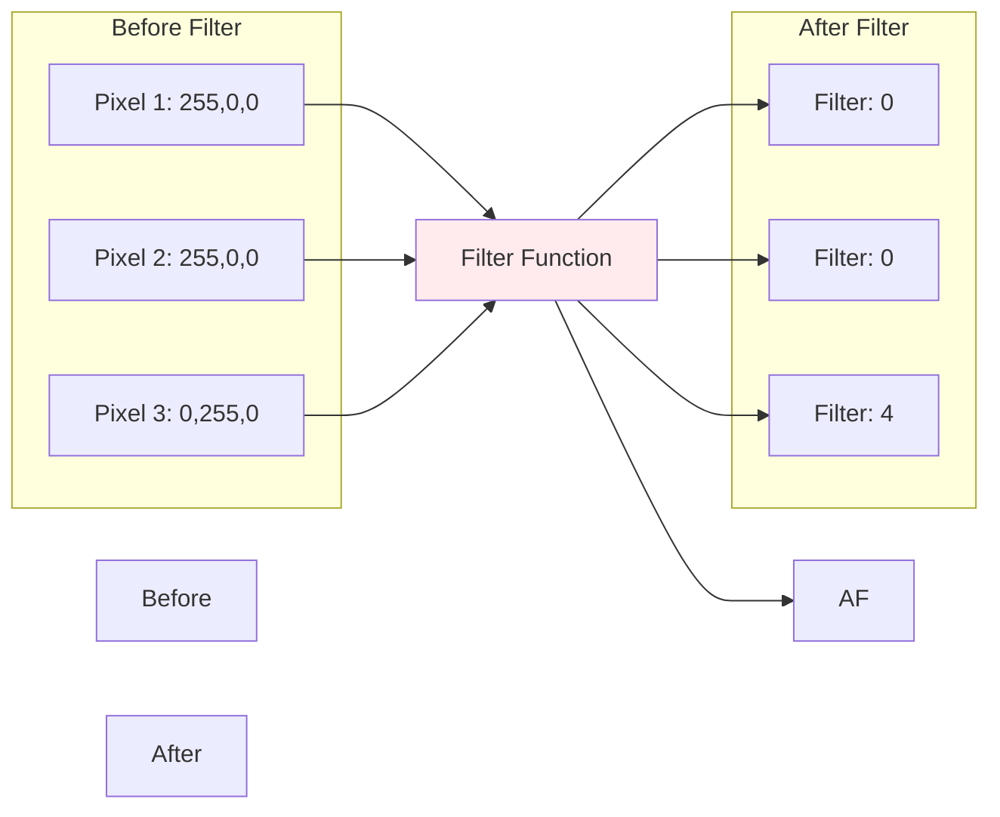

**Filter Types:**

| Filter | Formula | Best For |
|--------|---------|----------|
| **None** | `raw[x]` | Already compressed data |
| **Sub** | `raw[x] - raw[x-bpp]` | Gradients in a row |
| **Up** | `raw[x] - prior[x]` | Similar to row above |
| **Average** | `raw[x] - floor((raw[x-bpp] + prior[x])/2)` | Smooth areas |
| **Paeth** | `PaethPredictor(raw[x-bpp], prior[x], prior[x-bpp])` | Complex edges |

### Stage 2: DEFLATE (LZ77 + Huffman)

```mermaid
flowchart TD
    subgraph Input
    F["Filtered Data<br/>&#91;bytes&#93;"]
    end
    
    subgraph LZ77 Stage
    LZ["LZ77 Encoder<br/>Sliding Window 32KB"]
    LZ --> LZ1["Find Matches"]
    LZ --> LZ2["Emit: Literal or<br/>&#40;distance,length&#41;"]
    end
    
    subgraph Huffman Stage
    H["Huffman Encoder"]
    H --> H1["Count Symbols"]
    H --> H2["Build Tables"]
    H --> H3["Write Bits"]
    end
    
    subgraph Output
    O["Compressed<br/>&#91;bits&#93;"]
    end
    
    F --> LZ
    LZ --> H
    H --> O
    
    style Input fill:#e1f5fe
    style Output fill:#c8e6c9
    style LZ Stage fill:#fff3e0
    style Huffman Stage fill:#fff3e0
```

#### LZ77: Finding Repeated Patterns

```mermaid
flowchart LR
    Input["ABABABABABAB"]
    
    subgraph LZ77 Processing
    W["Sliding Window<br/>&#91;A,B,A,B,&#93;"]
    M["Match Finder"]
    O["Output:<br/>A, B, &#40;2,6&#41;"]
    end
    
    Input --> W
    W --> M
    M --> O
    
    style Input fill:#e3f2fd
    style Output fill:#c8e6c9
```

**How LZ77 works:**
1. Maintain a sliding window of recent bytes
2. For each position, find longest match in window
3. Output either a literal or a back-reference `(distance, length)`
4. Distance = how far back, Length = how many bytes

#### Huffman: Variable-Length Encoding

```mermaid
flowchart TD
    subgraph Frequency Count
    FC["Count Frequencies<br/>A:6, B:6"]
    end
    
    subgraph Build Tree
    BT["Build Huffman Tree"]
    FC --> BT
    BT --> T["Tree:<br/>A=0, B=1"]
    end
    
    subgraph Encode
    E["Encode Symbols"]
    E --> E1["A &#8594; 0"]
    E --> E2["B &#8594; 1"]
    end
    
    subgraph Result
    R["ABAB &#8594; 0101<br/>50% smaller"]
    end
    
    FC --> E
    BT --> E
    E --> R
    
    style Frequency Count fill:#e3f2fd
    style Result fill:#c8e6c9
```

---

## JPEG Algorithm Pipeline

JPEG uses a **multi-stage lossy compression** pipeline:

```mermaid
flowchart TD
    A["Raw Pixels<br/>&#91;R,G,B&#93;"] --> B[RGB to YCbCr]
    B --> C[Split 8×8 Blocks]
    C --> D[Apply DCT]
    D --> E[Quantization]
    E --> F[Zigzag Reorder]
    F --> G[Huffman Encoding]
    G --> H["JPEG File<br/>&#91;Markers + Data&#93;"]
    
    style A fill:#e1f5fe
    style H fill:#c8e6c9
    style E fill:#ffcdd2
    style G fill:#fff3e0
```

### Detailed JPEG Pipeline

```mermaid
flowchart TD
    subgraph Color Conversion
    CC["RGB &#8594; YCbCr<br/>&#91;Luma, Chroma&#93;"]
    end
    
    subgraph Block Processing
    BP["8×8 Block Split"]
    CC --> BP
    end
    
    subgraph DCT Stage
    DCT["Forward DCT<br/>Spatial &#8594; Frequency"]
    BP --> DCT
    end
    
    subgraph Quantization
    Q["Quantization<br/>&#40;Lossy Step&#41;"]
    DCT --> Q
    end
    
    subgraph Encoding
    Z["Zigzag Reorder"]
    H["Huffman Encoding"]
    Q --> Z
    Z --> H
    end
    
    subgraph Markers
    M["Insert Markers<br/>SOI, DQT, SOF, DHT, SOS, EOI"]
    H --> M
    end
    
    CC --> M
    
    style Quantization fill:#ffcdd2
    style Encoding fill:#fff3e0
    style Markers fill:#c8e6c9
```

### Key JPEG Stages Explained

#### 1. RGB to YCbCr Conversion

```mermaid
flowchart LR
    subgraph RGB Input
    R["R: 255"]
    G["G: 0"]
    B["B: 0"]
    end
    
    CC["Color Conversion<br/>Formulas"]
    
    subgraph YCbCr Output
    Y["Y: 76<br/>&#40;Luminance&#41;"]
    Cb["Cb: 84<br/>&#40;Blue Diff&#41;"]
    Cr["Cr: 255<br/>&#40;Red Diff&#41;"]
    end
    
    R --> CC
    G --> CC
    B --> CC
    
    CC --> Y
    CC --> Cb
    CC --> Cr
    
    style RGB Input fill:#e3f2fd
    style YCbCr Output fill:#fff3e0
```

**Why convert?** Human vision is more sensitive to luminance (brightness) than chrominance (color). JPEG can compress chroma more aggressively.

#### 2. Discrete Cosine Transform (DCT)

```mermaid
flowchart TD
    subgraph Spatial Domain
    S["8×8 Pixels<br/>&#91;0-255&#93;"]
    end
    
    DCT["Forward DCT<br/>&#40;64 &#8594; 64&#41;"]
    
    subgraph Frequency Domain
    F["DCT Coefficients<br/>&#91;DC, AC1, AC2...&#93;"]
    end
    
    subgraph Explanation
    E["DC = Average brightness<br/>AC = Detail at different frequencies"]
    end
    
    S --> DCT
    DCT --> F
    F --> E
    
    style Spatial Domain fill:#e3f2fd
    style Frequency Domain fill:#fff3e0
```

**DCT in action:**
```
Input (8×8 pixels):          Output (DCT Coefficients):
  52  55  61  66  70  61  64  73      1260  -20  -30   25   31   18  -5  -6
  63  59  55  90 109  85  69  72       -25  -31  -38   15   17   22  -4  -2
  67  61  55 106 127 104  69  65       -25  -35  -37   13   16   19  -3  -2
  75  63  64 111 144 122  88  84       -26  -30  -31   14   18  21  -3  -2
  81  68  78 123 155 139 100  93       -25  -30  -33   14   18  21  -3  -2
  80  85  84 105 127 131 109 101       -24  -28  -30   13   17  20  -3  -2
  83  86  83 111 134 137 113 120       -25  -30  -31   13   17  20  -3  -2
  90  94  92 107 121 127 122 115       -25  -31  -30   13   17  20  -3  -2
```

**DC coefficient** (top-left) represents the average brightness.
**AC coefficients** (rest) represent detail at increasing frequencies.

#### 3. Quantization (The Lossy Part)

```mermaid
flowchart LR
    subgraph DCT Coefficients
    DCT["&#91;1260, -20, -30...&#93;"]
    end
    
    Q["Divide by<br/>Quantization Table"]
    
    subgraph Quantized
    QOut["&#91;79, -1, -1...&#93;""]
    end
    
    subgraph Quality Impact
    QI["High Quality: Div by 16<br/>Low Quality: Div by 64"]
    end
    
    DCT --> Q
    Q --> QOut
    Q --> QI
    
    style DCT fill:#e3f2fd
    style Quantized fill:#c8e6c9
    style Quality Impact fill:#fff3e0
```

**Quantization table example:**
```
Luminance Table (Quality 50):
[16  11  10  16  24   40   51   61]
[12  12  14  19  26   58   60   55]
[14  13  16  24  40   57   69   56]
[14  17  22  29  51   87   80   62]
[18  22  37  56  68  109  103   77]
[24  35  55  64  81  104  113   92]
[49  64  78  87 103  121  120  101]
[72  92  95  98 112  100  103  99 ]
```

Higher values = more division = more compression = more quality loss.

#### 4. Zigzag Reordering

```mermaid
flowchart TD
    subgraph Before
    B["Quantized 8×8<br/>DC in corner"]
    end
    
    ZZ["Zigzag Order<br/>&#91;0,1,8,16...&#93;"]
    
    subgraph After
    A["1D Array<br/>DC first, then AC by frequency"]
    end
    
    B --> ZZ
    ZZ --> A
    
    style Before fill:#e3f2fd
    style After fill:#c8e6c9
```

**Why zigzag?** Groups similar frequencies together, putting zeros at the end for efficient RLE encoding.

#### 5. Huffman Encoding

Same as PNG - encodes the quantized coefficients using variable-length codes based on frequency.

---

## Side-by-Side Algorithm Comparison

```mermaid
flowchart TB
    subgraph PNG["PNG Pipeline (Lossless)"]
        direction LR
        PNG1["Raw Pixels"] --> PNG2["Apply Filter<br/>&#40;None, Sub, Up, Average, Paeth&#41;"]
        PNG2 --> PNG3["LZ77<br/>&#40;Sliding Window&#41;"]
        PNG3 --> PNG4["Huffman<br/>&#40;Entropy Coding&#41;"]
        PNG4 --> PNG5["PNG File<br/>&#40;Chunks&#41;"]
    end
    
    subgraph JPEG["JPEG Pipeline (Lossy)"]
        direction LR
        JP1["Raw Pixels"] --> JP2["RGB &#8594; YCbCr"]
        JP2 --> JP3["8×8 Blocks"]
        JP3 --> JP4["DCT<br/>&#40;Frequency Transform&#41;"]
        JP4 --> JP5["Quantization<br/>&#40;Lossy Step&#41;"]
        JP5 --> JP6["Zigzag Reorder"]
        JP6 --> JP7["Huffman<br/>&#40;Entropy Coding&#41;"]
        JP7 --> JP8["JPEG File<br/>&#40;Markers&#41;"]
    end
    
    style PNG fill:#e8f5e9
    style JPEG fill:#fff3e0
```

### Algorithm Comparison Table

| Stage | PNG | JPEG |
|-------|-----|------|
| **Input** | Raw pixels (any color type) | RGB pixels only |
| **Color Transform** | None (optional optimization) | RGB → YCbCr (mandatory) |
| **Block Transform** | None | 8×8 DCT (mandatory) |
| **Predictive** | Per-row filters (optional) | None |
| **Lossy Step** | None (always lossless) | Quantization (required) |
| **Compression** | LZ77 + Huffman | LZ77-style (simplified) + Huffman |
| **Output Format** | Chunk-based (IHDR, IDAT, etc.) | Marker-based (SOI, DQT, etc.) |

### Key Algorithmic Differences

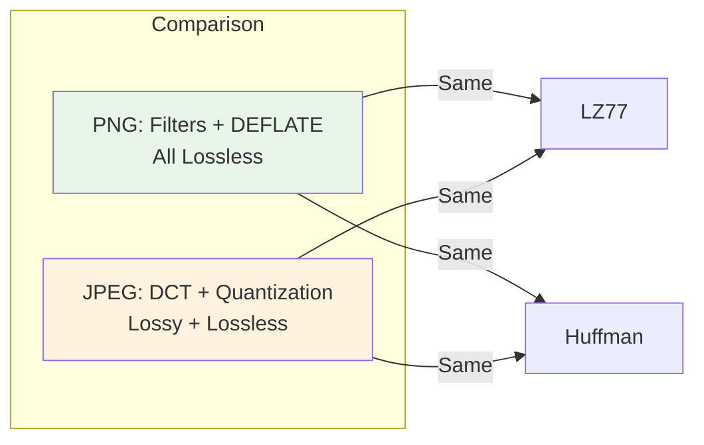

---

## When to Use Which Format

### Use PNG When:

```
✓ Screenshots with text
✓ UI elements and icons  
✓ Logos and graphics
✓ Images requiring exact pixel reproduction
✓ Images with transparency (alpha channel)
✓ Technical diagrams
✓ Images with sharp edges and solid colors
```

### Use JPEG When:

```
✓ Photographs (natural scenes)
✓ Web photos and backgrounds
✓ Social media images
✓ Any image where slight quality loss is acceptable
✓ File size is critical
✓ Gradients and smooth transitions
```

### Decision Flowchart

```mermaid
flowchart TD
    A["Start: What type of image?"] --> B{Is it a photo?}
    
    B -->|Yes| C{"Is file size<br/>important?"}
    B -->|No| D{"Does it need<br/>transparency?"}
    
    C -->|Yes| E["Use JPEG<br/>Quality 85%"]
    C -->|No| F["Use PNG<br/>or JPEG Quality 95%"]
    
    D -->|Yes| G["Use PNG<br/>&#40;RGBA&#41;"]
    D -->|No| H{"Sharp edges?"}
    
    H -->|Yes| I["Use PNG"]
    H -->|No| J{"Gradients?"}
    
    J -->|Yes| K["Use JPEG"]
    J -->|No| L["Use PNG"]
    
    style A fill:#e3f2fd
    style B fill:#fff3e0
    style C fill:#fff3e0
    style D fill:#fff3e0
```

---

## File Size Comparison Example

| Image Type | Original | PNG Size | JPEG Size | Savings |
|------------|----------|----------|-----------|---------|
| UI Screenshot | 1.2 MB | 245 KB | 312 KB | **PNG 27% smaller** |
| Photo of Sky | 2.4 MB | 1.8 MB | 145 KB | **JPEG 94% smaller** |
| Logo with Text | 128 KB | 24 KB | 38 KB | **PNG 37% smaller** |
| Portrait Photo | 3.1 MB | 2.4 MB | 198 KB | **JPEG 94% smaller** |

---

## Summary

| Question | Answer |
|----------|--------|
| **Is PNG lossy or lossless?** | PNG is 100% lossless. Every pixel is preserved exactly. |
| **Is JPEG lossy or lossless?** | JPEG is lossy by design. Quantization discards information. |
| **Why PNG for graphics?** | Sharp edges + solid colors + no artifacts = perfect for UI/screenshots |
| **Why JPEG for photos?** | Gradients + noise + human vision forgiving = excellent compression with minimal visible loss |
| **Can PNG be lossy?** | No, but `pngquant` creates lossy PNGs by quantizing to palette first |
| **Can JPEG be lossless?** | Yes, JPEG-LS and lossless JPEG exist, but they're rarely used |
| **What's the key algorithm difference?** | PNG: Filters + DEFLATE. JPEG: DCT + Quantization + Huffman. |
| **Where do JPEG artifacts come from?** | The quantization step discards high-frequency detail, causing blocking and ringing. |

---

## Further Reading

- [PNG Specification - W3C](https://w3c.github.io/png/)
- [JPEG Standard - ITU-T](https://www.itu.int/rec/T-REC-T.81)
- [RFC 1950 - Zlib](https://datatracker.ietf.org/doc/rfc1950/)
- [RFC 1951 - DEFLATE](https://datatracker.ietf.org/doc/rfc1951/)
- [pixo PNG Implementation](https://github.com/leerob/pixo/blob/main/src/png/mod.rs)
