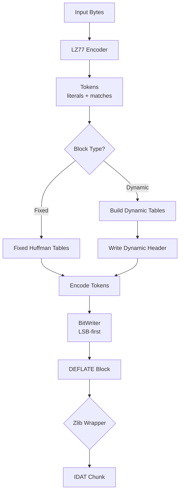

# DEFLATE Compression: Blocks, Huffman Coding, and Bit Streams

This guide explains DEFLATE compression blocks, the core algorithm used inside PNG's zlib-wrapped IDAT chunks. DEFLATE combines LZ77 tokenization with Huffman coding to achieve efficient compression.

---

## What is DEFLATE?

**DEFLATE** (RFC 1951) is a lossless compression algorithm that combines two techniques:

1. **LZ77**: Finds repeated sequences and replaces them with back-references (distance, length)
2. **Huffman Coding**: Assigns variable-length bit codes to symbols based on frequency

DEFLATE organizes compressed data into **blocks**, each with its own compression strategy.

---

## DEFLATE Block Structure

Every DEFLATE stream consists of one or more blocks:

```text
┌─────────────────────────────────────────────────────────────┐
│ Block 1 (fixed) │ Block 2 (dynamic) │ Block 3 (stored)    │
└─────────────────────────────────────────────────────────────┘
```

Each block starts with a **3-bit header**:

| Bits   | Meaning                                                          |
| ------ | ---------------------------------------------------------------- |
| Bit 0  | BFINAL: 1 if this is the last block                              |
| Bits 1-2 | BTYPE: Block type (00=stored, 01=fixed, 10=dynamic, 11=reserved) |

### Block Types

**Type 0 (Stored)**: Uncompressed data
- Used when data is incompressible or already compressed
- Simple format: header + LEN/NLEN + raw bytes
- 5-byte overhead per block (max 65535 bytes per block)

**Type 1 (Fixed Huffman)**: Predefined Huffman tables
- Uses RFC1951 fixed code lengths (no table transmission needed)
- Good for small data or when encoding speed matters
- Implemented in `src/compress/fixed_huffman_tables.go`

**Type 2 (Dynamic Huffman)**: Custom Huffman tables
- Tables are transmitted before the data (HLIT/HDIST/HCLEN + code lengths)
- Best compression for larger blocks
- Implemented in `src/compress/huffman_header.go` and `src/compress/dynamic_tables.go`

---

## Bit Ordering: LSB-First

DEFLATE packs bits **LSB-first** (least significant bit first) within bytes. This is different from many other formats that use MSB-first.

```text
Bits written: 1, 0, 1, 1, 0
              ▲
              │ first bit goes to bit 0 (rightmost)

Resulting byte: 0b_???01011
                      ▲▲▲▲▲
                      │││││
                      5th bit ─┘│││
                      4th bit ──┘││
                      3rd bit ───┘│
                      2nd bit ────┘
                      1st bit ─────┘
```

Our `BitWriter` (`src/compress/bit_writer.go`) handles LSB-first writing:

```go
func (bw *BitWriter) Write(bits uint16, n int) error {
    for i := 0; i < n; i++ {
        bit := (bits >> uint(i)) & 1  // Extract LSB first
        bw.buf |= byte(bit) << uint(bw.nbits)
        // ...
    }
}
```

**Why LSB-first?** Historical reasons—DEFLATE was designed for efficient bit manipulation on little-endian systems. The bit order is consistent throughout the DEFLATE format.

---

## Fixed Huffman Tables

Fixed blocks use predefined code lengths from RFC1951:

### Literal/Length Table (0-287 symbols)

| Symbol Range | Code Length |
| ------------ | ----------- |
| 0-143        | 8 bits      |
| 144-255      | 9 bits      |
| 256-279      | 7 bits      |
| 280-287      | 8 bits      |

**Why these lengths?** They provide reasonable compression for typical text/data without needing to transmit the tables. The shorter codes (7 bits) are assigned to length symbols (256-279), which are common in compressed data.

### Distance Table (0-29 symbols)

All distance codes use **5 bits**.

**Why 5 bits?** Distances are less frequent than literals, so a fixed 5-bit code is a good tradeoff between table size and compression efficiency.

Our implementation (`src/compress/fixed_huffman_tables.go`):

```go
func LiteralLengthTable() Table {
    lengths := make([]int, 288)
    // Assign lengths per RFC1951...
    codes, _ := buildTableFromLengths(lengths)
    return Table{Codes: codes, MaxLength: 9}
}
```

---

## Dynamic Huffman Tables

Dynamic blocks build custom Huffman tables optimized for the specific data in the block.

### Building Dynamic Tables

1. **Count frequencies**: How often does each literal/length and distance symbol appear?
2. **Build Huffman tree**: Connect symbols based on frequency (most frequent = shortest code)
3. **Extract code lengths**: Traverse tree to get length for each symbol
4. **Canonicalize**: Assign codes deterministically (same lengths → same codes)

Our implementation (`src/compress/dynamic_tables.go`):

```go
func BuildDynamicTables(litFreq []int, distFreq []int) (litTable Table, distTable Table) {
    litTree := BuildTree(litFreq)
    codesMap := GenerateCodes(litTree)
    litCodes, litLengths := Canonicalize(codesMap)
    // ...
}
```

### Dynamic Block Header

Before the compressed data, dynamic blocks transmit the Huffman tables:

1. **HLIT** (5 bits): Number of literal/length codes - 257
2. **HDIST** (5 bits): Number of distance codes - 1
3. **HCLEN** (4 bits): Number of code length codes - 4
4. **Code length code lengths** (3 bits each, in DEFLATE order)
5. **RLE-encoded literal/length code lengths**
6. **RLE-encoded distance code lengths**

**Why RLE?** Code lengths often have long runs of zeros (unused symbols) or repeated values. RLE reduces the header size.

**RLE Symbols**:
- **16**: Repeat previous code length 3-6 times (+ 2 bits)
- **17**: Zero run of 3-10 (+ 3 bits)
- **18**: Zero run of 11-138 (+ 7 bits)

---

## Encoding Literals, Lengths, and Distances

### Literal Encoding

Literals (0-255) and end-of-block (256) are encoded directly using the literal/length table:

```go
func EncodeLiteral(w *BitWriter, symbol int, table Table) error {
    code := table.Codes[symbol]
    return w.Write(code.Bits, code.Length)
}
```

### Length Encoding

Match lengths (3-258) are encoded as:
1. **Length code** (257-285): Maps to a base length
2. **Extra bits**: Fine-tune the length within the range

**Example**: Length 18
- Base: 17 (from `LengthBase[268-257]`)
- Range: 17-18 (1 extra bit)
- Code: 268 (7 bits in fixed table)
- Extra: 18 - 17 = 1 (1 bit)

Our implementation (`src/compress/deflate_literal_encoder.go`):

```go
func EncodeLength(w *BitWriter, length int, table Table) error {
    code := findLengthCode(length)  // 257-285
    huffmanCode := table.Codes[code]
    w.Write(huffmanCode.Bits, huffmanCode.Length)
    // Write extra bits if needed...
}
```

### Distance Encoding

Distances (1-32768) use a separate distance table:

**Example**: Distance 10
- Base: 9 (from `DistanceBase[5]`)
- Range: 9-10 (1 extra bit)
- Code: 5 (5 bits in fixed table)
- Extra: 10 - 9 = 1 (1 bit)

---

## The Complete DEFLATE Pipeline



### Step-by-Step Example

**Input**: `"ABCABC"`

1. **LZ77**: `['A', 'B', 'C', Match(distance=3, length=3)]`
2. **Fixed Block**:
   - Header: `011` (BFINAL=1, type=01)
   - Literal 'A': code for 65 (8 bits)
   - Literal 'B': code for 66 (8 bits)
   - Literal 'C': code for 67 (8 bits)
   - Length 3: code 257 (7 bits) + 0 extra bits
   - Distance 3: code 2 (5 bits) + 0 extra bits
   - End-of-block: code 256 (7 bits)
3. **BitWriter**: Packs bits LSB-first into bytes
4. **Result**: Compressed DEFLATE block

---

## Why Fixed vs Dynamic?

| Feature | Fixed | Dynamic |
| ------- | ----- | ------- |
| **Header Size** | 0 bytes | ~50-200 bytes |
| **Compression** | Good for typical data | Better for skewed distributions |
| **Encoding Speed** | Faster (no table building) | Slower (build + transmit tables) |
| **Use Case** | Small blocks, speed-critical | Large blocks, maximum compression |

**Rule of thumb**: Use fixed for blocks < 1KB, dynamic for larger blocks.

---

## Implementation Files

| Component | File | Purpose |
| --------- | ---- | ------- |
| Fixed Tables | `src/compress/fixed_huffman_tables.go` | RFC1951 predefined tables |
| Bit Writer | `src/compress/bit_writer.go` | LSB-first bit writing |
| Constants | `src/compress/deflate_constants.go` | Length/distance base+extra tables |
| Encoders | `src/compress/deflate_literal_encoder.go` | Encode literals/lengths/distances |
| Dynamic Tables | `src/compress/dynamic_tables.go` | Build custom Huffman tables |
| Dynamic Header | `src/compress/huffman_header.go` | Write HLIT/HDIST/HCLEN + RLE |
| Block Writer | `src/compress/deflate_block.go` | Write stored/fixed/dynamic blocks |

---

## Summary

1. **DEFLATE blocks**: Three types (stored, fixed, dynamic) with 3-bit headers
2. **LSB-first**: Bits are packed least-significant-bit first (unlike many formats)
3. **Fixed tables**: Predefined code lengths for fast encoding
4. **Dynamic tables**: Custom tables optimized per block (better compression)
5. **RLE encoding**: Compresses code length sequences in dynamic headers
6. **Length/distance encoding**: Base code + extra bits for fine-tuning

DEFLATE is the compression engine inside PNG's IDAT chunks, wrapped in zlib format (CMF/FLG header + Adler32 footer).

---

## Next Steps

- Learn about [PNG Filters](../png-encoding.md#the-five-png-filters) (Sub, Up, Average, Paeth)
- Understand [PNG Encoding Pipeline](../png-encoding.md#the-png-pipeline)
- Explore [LZ77 Compression](../lz77-compression.md) internals
- Study [Huffman Coding](../huffman-coding.md) algorithms
