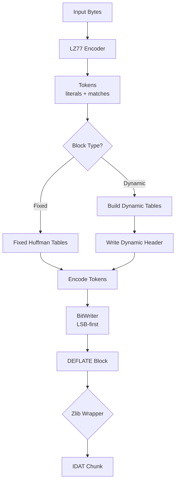

# DEFLATE Compression: Blocks, Huffman Coding, and Bit Streams

This guide explains DEFLATE compression blocks, the core algorithm used inside PNG's zlib-wrapped IDAT chunks. DEFLATE combines LZ77 tokenization with Huffman coding to achieve efficient compression.

---

## What is DEFLATE?

**DEFLATE** (RFC 1951) is a lossless compression algorithm that combines two techniques:

1. **LZ77**: Finds repeated sequences and replaces them with back-references (distance, length)
2. **Huffman Coding**: Assigns variable-length bit codes to symbols based on frequency

DEFLATE organizes compressed data into **blocks**, each with its own compression strategy.

---

## DEFLATE Block Structure

Every DEFLATE stream consists of one or more blocks:

```text
┌─────────────────────────────────────────────────────────────┐
│ Block 1 (fixed) │ Block 2 (dynamic) │ Block 3 (stored)    │
└─────────────────────────────────────────────────────────────┘
```

Each block starts with a **3-bit header**:

| Bits   | Meaning                                                          |
| ------ | ---------------------------------------------------------------- |
| Bit 0  | BFINAL: 1 if this is the last block                              |
| Bits 1-2 | BTYPE: Block type (00=stored, 01=fixed, 10=dynamic, 11=reserved) |

### Block Types

**Type 0 (Stored)**: Uncompressed data
- Used when data is incompressible or already compressed
- Simple format: header + LEN/NLEN + raw bytes
- 5-byte overhead per block (max 65535 bytes per block)
- See [DEFLATE Block Writer](deflate-block-writer.md) for implementation details

**Type 1 (Fixed Huffman)**: Predefined Huffman tables
- Uses RFC1951 fixed code lengths (no table transmission needed)
- Good for small data or when encoding speed matters
- Implemented in `src/compress/fixed_huffman_tables.go`
- See [DEFLATE Block Writer](deflate-block-writer.md) for implementation details

**Type 2 (Dynamic Huffman)**: Custom Huffman tables
- Tables are transmitted before the data (HLIT/HDIST/HCLEN + code lengths)
- Best compression for larger blocks
- Implemented in `src/compress/huffman_header.go` and `src/compress/dynamic_tables.go`
- See [DEFLATE Block Writer](deflate-block-writer.md) for implementation details

---

## Bit Ordering: LSB-First

DEFLATE packs bits **LSB-first** (least significant bit first) within bytes. This is different from many other formats that use MSB-first.

### Visual Explanation

When writing bits sequentially, the first bit goes into the rightmost position (bit 0):

```text
Bits written: 1, 0, 1, 1, 0
              ▲
              │ first bit goes to bit 0 (rightmost)

Resulting byte: 0b_???01011
                      ▲▲▲▲▲
                      │││││
                      5th bit ─┘│││
                      4th bit ──┘││
                      3rd bit ───┘│
                      2nd bit ────┘
                      1st bit ─────┘
```

### Bit Buffering

The `BitWriter` accumulates bits in an internal buffer until a full byte (8 bits) is formed:

```text
Step 1: Write 3 bits (101)
  Buffer: 0b_00000101 (nbits=3)
  
Step 2: Write 2 more bits (10)
  Buffer: 0b_00010101 (nbits=5)
  
Step 3: Write 3 more bits (111)
  Buffer: 0b_11110101 (nbits=8) → Flush to output
  Buffer: 0b_00000000 (nbits=0)
```

Our `BitWriter` (`src/compress/bit_writer.go`) handles LSB-first writing:

```go
func (bw *BitWriter) Write(bits uint16, n int) error {
    for i := 0; i < n; i++ {
        bit := (bits >> uint(i)) & 1  // Extract LSB first
        bw.buf |= byte(bit) << uint(bw.nbits)
        bw.nbits++
        
        if bw.nbits == 8 {
            bw.flushByte()  // Write full byte
        }
    }
    return nil
}

func (bw *BitWriter) Flush() error {
    if bw.nbits > 0 {
        return bw.flushByte()  // Write remaining partial byte
    }
    return nil
}
```

**Why LSB-first?** Historical reasons—DEFLATE was designed for efficient bit manipulation on little-endian systems. The bit order is consistent throughout the DEFLATE format. When reading bits back, decoders extract bits starting from bit 0 (rightmost) and work leftward.

---

## Fixed Huffman Tables

Fixed blocks use predefined code lengths from RFC1951 Table 1 and Table 2. These tables are **hardcoded** in the DEFLATE specification, so no table transmission is needed—decoders know them by heart.

### RFC1951 Table 1: Literal/Length Table (0-287 symbols)

The fixed literal/length table covers:
- **Symbols 0-255**: Literal byte values
- **Symbol 256**: End-of-block marker
- **Symbols 257-285**: Length codes (for match lengths 3-258)

| Symbol Range | Code Length | Purpose |
| ------------ | ----------- | ------- |
| 0-143        | 8 bits      | Common literals (ASCII printable) |
| 144-255      | 9 bits      | Less common literals (extended ASCII) |
| 256          | 7 bits      | End-of-block marker |
| 257-279      | 7 bits      | Short length codes (3-258 bytes) |
| 280-287      | 8 bits      | Reserved/extension length codes |

**Why these lengths?** 
- **7-bit codes** for length symbols (256-279) optimize for common match lengths
- **8-bit codes** for most literals provide good balance
- **9-bit codes** for extended literals handle edge cases
- No table overhead—decoders can reconstruct codes from lengths using canonical Huffman

### RFC1951 Table 2: Distance Table (0-29 symbols)

All distance codes use **5 bits** uniformly.

| Symbol Range | Code Length | Purpose |
| ------------ | ----------- | ------- |
| 0-29         | 5 bits      | Distance codes (1-32768 bytes) |

**Why 5 bits?** 
- Distances are less frequent than literals in typical data
- Fixed 5-bit codes simplify decoding
- Extra bits (0-13) extend the range to 32768 bytes

### Using Fixed Tables

Our implementation (`src/compress/fixed_huffman_tables.go`):

```go
// Get the fixed literal/length table
litTable := LiteralLengthTable()
// litTable.Codes[0-287] contains canonical Huffman codes
// litTable.MaxLength = 9

// Get the fixed distance table
distTable := DistanceTable()
// distTable.Codes[0-29] contains canonical Huffman codes
// distTable.MaxLength = 5

// Encode a literal byte 'A' (ASCII 65)
code := litTable.Codes[65]
bitWriter.Write(code.Bits, code.Length)  // Writes 8 bits

// Encode end-of-block
code = litTable.Codes[256]
bitWriter.Write(code.Bits, code.Length)  // Writes 7 bits

// Encode distance 10
distCode := distTable.Codes[5]  // Distance code for ~10
bitWriter.Write(distCode.Bits, distCode.Length)  // Writes 5 bits
```

### Canonical Code Construction

Fixed tables use **canonical Huffman coding**: codes are assigned deterministically based on code lengths:

1. Sort symbols by length (shortest first)
2. Assign codes sequentially: 0, 1, 2, ...
3. When length increases, shift left and continue: `code = (code + count) << 1`
4. Store codes **LSB-first** (bit-reversed) for DEFLATE

This ensures any decoder can reconstruct the exact same codes from just the lengths.

---

## Dynamic Huffman Tables

Dynamic blocks build custom Huffman tables optimized for the specific data in the block. This provides better compression than fixed tables but requires transmitting the table structure.

### Building Dynamic Tables Algorithm

The process follows these steps:

1. **Count frequencies**: Count how often each literal/length (0-287) and distance (0-29) symbol appears in the data
2. **Build Huffman tree**: Construct a binary tree where frequent symbols have shorter paths (using priority queue)
3. **Extract code lengths**: Traverse the tree to determine code length for each symbol
4. **Canonicalize**: Convert lengths to canonical Huffman codes (deterministic assignment)

Our implementation (`src/compress/dynamic_tables.go`):

```go
func BuildDynamicTables(litFreq []int, distFreq []int) (litTable Table, distTable Table) {
    // Build literal/length tree from frequencies
    litTree := BuildTree(litFreq)
    codesMap := GenerateCodes(litTree)
    litCodes, litLengths := Canonicalize(codesMap)
    
    // Build distance tree from frequencies
    distTree := BuildTree(distFreq)
    codesMap = GenerateCodes(distTree)
    distCodes, distLengths := Canonicalize(codesMap)
    
    return Table{Codes: litCodes, MaxLength: max(litLengths)},
           Table{Codes: distCodes, MaxLength: max(distLengths)}
}
```

**Example**: If symbol 'A' appears 100 times and 'B' appears 10 times, 'A' gets a shorter code.

### Dynamic Block Header Structure

Before the compressed data, dynamic blocks transmit the Huffman tables in this order:

#### 1. HLIT (5 bits): Literal/Length Code Count

```
HLIT = number of literal/length codes - 257
Range: 257-286 (encoded as 0-29)
```

**Example**: If you use codes 0-285, HLIT = 285 - 257 = 28 (encoded as 5 bits: `11100`)

#### 2. HDIST (5 bits): Distance Code Count

```
HDIST = number of distance codes - 1
Range: 1-30 (encoded as 0-29)
```

**Example**: If you use codes 0-4, HDIST = 5 - 1 = 4 (encoded as 5 bits: `00100`)

#### 3. HCLEN (4 bits): Code Length Code Count

```
HCLEN = number of code length codes - 4
Range: 4-19 (encoded as 0-15)
```

Code length codes are used to encode the literal/length and distance code lengths themselves.

#### 4. Code Length Code Lengths (3 bits each)

The code length codes (0-18) are stored in a special order defined by `CodeLengthOrder`:

```
Order: [16, 17, 18, 0, 8, 7, 9, 6, 10, 5, 11, 4, 12, 3, 13, 2, 14, 1, 15]
```

Each code length code gets 3 bits (0-7 length).

#### 5. RLE-Encoded Literal/Length Code Lengths

The actual code lengths for symbols 0-285 are encoded using RLE compression.

#### 6. RLE-Encoded Distance Code Lengths

The actual code lengths for distance symbols 0-29 are encoded using RLE compression.

### RLE Encoding for Code Lengths

Code lengths often have long runs of zeros (unused symbols) or repeated values. RLE reduces header size significantly.

**RLE Symbols** (encoded using the code length table):

| Symbol | Meaning | Extra Bits | Range |
| ------ | ------- | ---------- | ----- |
| 0-15   | Literal code length | 0 | Direct length value |
| 16     | Repeat previous length | 2 bits | 3-6 repetitions |
| 17     | Zero run | 3 bits | 3-10 zeros |
| 18     | Zero run | 7 bits | 11-138 zeros |

**Example RLE Encoding**:

```text
Original lengths: [8, 8, 8, 0, 0, 0, 0, 0, 9, 9, 9, 9, 9, 9]

Encoded:
  8 (literal)
  16 (repeat) + 2 extra bits = 2 → repeat 8 three more times (total 4)
  17 (zero run) + 3 extra bits = 4 → 5 zeros
  9 (literal)
  16 (repeat) + 2 extra bits = 4 → repeat 9 five more times (total 6)
```

This compresses 14 values into ~6-8 symbols, saving significant space.

### Complete Header Example

```go
// Build dynamic tables from frequencies
litTable, distTable := BuildDynamicTables(litFreq, distFreq)

// Extract code lengths
litLengths := extractLengths(litTable)
distLengths := extractLengths(distTable)

// Write header
bitWriter := NewBitWriter(output)
WriteDynamicHeader(bitWriter, litLengths, distLengths)

// Now encode data using litTable and distTable
```

**Why Dynamic Tables?** For data with skewed symbol distributions (e.g., mostly 'A' characters), dynamic tables assign very short codes to frequent symbols, achieving better compression than fixed tables. The overhead (~50-200 bytes) is amortized over larger blocks.

---

## Encoding Literals, Lengths, and Distances

### Literal Encoding

Literals (0-255) and end-of-block (256) are encoded directly using the literal/length table:

```go
func EncodeLiteral(w *BitWriter, symbol int, table Table) error {
    code := table.Codes[symbol]
    return w.Write(code.Bits, code.Length)
}
```

### Length Encoding

Match lengths (3-258) are encoded as:
1. **Length code** (257-285): Maps to a base length
2. **Extra bits**: Fine-tune the length within the range

**Example**: Length 18
- Base: 17 (from `LengthBase[268-257]`)
- Range: 17-18 (1 extra bit)
- Code: 268 (7 bits in fixed table)
- Extra: 18 - 17 = 1 (1 bit)

Our implementation (`src/compress/deflate_literal_encoder.go`):

```go
func EncodeLength(w *BitWriter, length int, table Table) error {
    code := findLengthCode(length)  // 257-285
    huffmanCode := table.Codes[code]
    w.Write(huffmanCode.Bits, huffmanCode.Length)
    // Write extra bits if needed...
}
```

### Distance Encoding

Distances (1-32768) use a separate distance table:

**Example**: Distance 10
- Base: 9 (from `DistanceBase[5]`)
- Range: 9-10 (1 extra bit)
- Code: 5 (5 bits in fixed table)
- Extra: 10 - 9 = 1 (1 bit)

---

## The Complete DEFLATE Pipeline

See [DEFLATE Encoder](deflate-encoder.md) for a detailed explanation of the encoding pipeline from raw data to compressed blocks.



### Step-by-Step Example

**Input**: `"ABCABC"`

1. **LZ77**: `['A', 'B', 'C', Match(distance=3, length=3)]`
2. **Fixed Block**:
   - Header: `011` (BFINAL=1, type=01)
   - Literal 'A': code for 65 (8 bits)
   - Literal 'B': code for 66 (8 bits)
   - Literal 'C': code for 67 (8 bits)
   - Length 3: code 257 (7 bits) + 0 extra bits
   - Distance 3: code 2 (5 bits) + 0 extra bits
   - End-of-block: code 256 (7 bits)
3. **BitWriter**: Packs bits LSB-first into bytes
4. **Result**: Compressed DEFLATE block

---

## Why Fixed vs Dynamic?

| Feature | Fixed | Dynamic |
| ------- | ----- | ------- |
| **Header Size** | 0 bytes | ~50-200 bytes |
| **Compression** | Good for typical data | Better for skewed distributions |
| **Encoding Speed** | Faster (no table building) | Slower (build + transmit tables) |
| **Use Case** | Small blocks, speed-critical | Large blocks, maximum compression |

**Rule of thumb**: Use fixed for blocks < 1KB, dynamic for larger blocks.

---

## Implementation Files

| Component | File | Purpose |
| --------- | ---- | ------- |
| Fixed Tables | `src/compress/fixed_huffman_tables.go` | RFC1951 predefined tables |
| Bit Writer | `src/compress/bit_writer.go` | LSB-first bit writing |
| Constants | `src/compress/deflate_constants.go` | Length/distance base+extra tables |
| Encoders | `src/compress/deflate_literal_encoder.go` | Encode literals/lengths/distances |
| Dynamic Tables | `src/compress/dynamic_tables.go` | Build custom Huffman tables |
| Dynamic Header | `src/compress/huffman_header.go` | Write HLIT/HDIST/HCLEN + RLE |
| Block Writer | `src/compress/deflate_block.go` | Write stored/fixed/dynamic blocks |

---

## Summary

1. **DEFLATE blocks**: Three types (stored, fixed, dynamic) with 3-bit headers
2. **LSB-first**: Bits are packed least-significant-bit first (unlike many formats)
3. **Fixed tables**: Predefined code lengths for fast encoding
4. **Dynamic tables**: Custom tables optimized per block (better compression)
5. **RLE encoding**: Compresses code length sequences in dynamic headers
6. **Length/distance encoding**: Base code + extra bits for fine-tuning

DEFLATE is the compression engine inside PNG's IDAT chunks, wrapped in zlib format (CMF/FLG header + Adler32 footer).

---

## Related Documentation

- [DEFLATE Block Writer](deflate-block-writer.md): How stored, fixed, and dynamic blocks are written
- [DEFLATE Encoder](deflate-encoder.md): The complete pipeline from data to compressed blocks
- [IDAT Zlib Integration](idat-zlib-integration.md): How PNG IDAT chunks use zlib-wrapped DEFLATE

## Next Steps

- Learn about [PNG Filters](../png-encoding.md#the-five-png-filters) (Sub, Up, Average, Paeth)
- Understand [PNG Encoding Pipeline](../png-encoding.md#the-png-pipeline)
- Explore [LZ77 Compression](../lz77-compression.md) internals
- Study [Huffman Coding](../huffman-coding.md) algorithms
