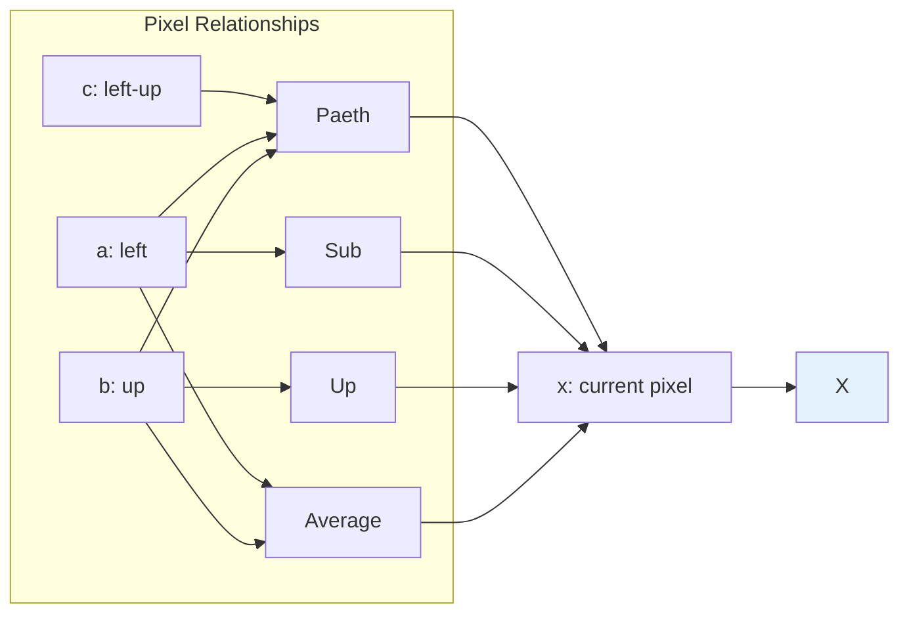
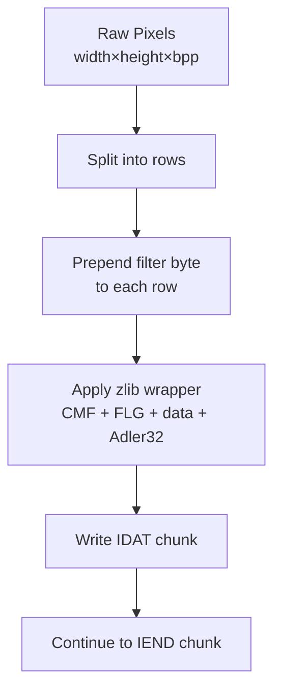

# PNG Scanlines: Image Rows and Filter Bytes

This guide explains **scanlines**, the fundamental unit of image data in PNG files, and the role of **filter bytes** that precede each row.

---

## What is a Scanline?

A **scanline** is a single **row of pixels** in a PNG image. PNG stores images as a sequence of scanlines, each with a **filter byte** prepended.

### Why Filter Bytes?

Before compression, PNG applies **filtering** to each row. The filter byte tells the decoder how to **reconstruct the original pixel values** from the (possibly filtered) data:

```text
┌─────────────┬───────────────────────────────────────────────┐
│ 1 byte      │ N bytes (pixels)                              │
│ Filter Type │ Pixel data for this row                       │
└─────────────┴───────────────────────────────────────────────┘
```

### Benefits of Filtering

Filtering exploits **spatial redundancy** within an image:
- Adjacent pixels are often similar
- Predicting from neighbors reduces entropy
- Better compression ratio

---

## Scanline Structure

### Bytes Per Pixel (BPP)

| Color Type | Bytes Per Pixel | Description |
|------------|-----------------|-------------|
| 0 (Grayscale) | 1 | Single channel: intensity |
| 2 (RGB) | 3 | Red, Green, Blue |
| 6 (RGBA) | 4 | RGB + Alpha channel |

### Scanline Length Formula

```
scanline_length = 1 (filter byte) + width × bytes_per_pixel
```

### Example: 2×2 RGB Image

```
Original pixels:
[00 FF 00] [FF 00 00]
[00 00 FF] [FF FF FF]

With filter byte 0 (None) prepended to each row:

Row 0: [00 00 FF 00 00 FF 00 00]
        └──┬──┘ └──────┬───────┘
         filter      6 pixels (2×3 bytes)

Row 1: [00 00 00 FF FF FF FF FF FF]
        └──┬──┘ └──────┬───────┘
         filter      6 pixels (2×3 bytes)

Total IDAT data: 8 + 8 = 16 bytes (4 + 4 filter bytes, 12 pixel bytes)
```

---

## Filter Types

PNG defines **5 filter types**, each with a different prediction method:

| Type | Name | Prediction |
|------|------|------------|
| 0 | None | `x` |
| 1 | Sub | `x - a` |
| 2 | Up | `x - b` |
| 3 | Average | `x - floor((a + b) / 2)` |
| 4 | Paeth | `x - Paeth(a, b, c)` |

### Filter Type Constants

```go
type FilterType uint8

const (
    FilterNone    FilterType = 0  // No filtering (raw pixel values)
    FilterSub     FilterType = 1  // Predict from left pixel
    FilterUp      FilterType = 2  // Predict from above pixel
    FilterAverage FilterType = 3  // Predict from average of left + above
    FilterPaeth   FilterType = 4  // Predict using Paeth algorithm
)
```

### Visualization



---

## Filter Type Details

### Filter Type 0: None

**Simplest filter**: No prediction, store raw values.

```
Raw:    [255, 0, 0, 128, 64, 32]
Stored: [00, 255, 0, 0, 128, 64, 32]
         ↑
      filter=0
```

**Use case**: First row of image (no "above" row available).

### Filter Type 1: Sub

**Predict from left pixel**: Store `x - a` where `a` is the pixel to the left.

```
Pixels: [255, 0, 0, 128, 64, 32]
        a    x

Sub:    [00, 255-255=0, 0-0=0, 128-0=128, 64-128=-64→192, 32-64=-32→224]
Stored: [01, 0, 0, 128, 192, 224]
```

**Use case**: Horizontal edges, left-to-right gradients.

### Filter Type 2: Up

**Predict from above pixel**: Store `x - b` where `b` is the pixel above.

```
Row 0:  [255, 0, 0, 128, 64, 32]
Row 1:  [255, 0, 0, 128, 64, 32] (same as row 0)

Up:     [00, 255-255=0, 0-0=0, 128-128=0, 64-64=0, 32-32=0]
Stored: [02, 0, 0, 0, 0, 0, 0]
```

**Use case**: Vertical repetition, flat areas.

### Filter Type 3: Average

**Predict from average**: Store `x - floor((a + b) / 2)`.

```
Pixels: [128, 128, 128, 128]
Left:   [100, 128, 128, 128]
Above:  [156, 128, 128, 128]

Avg:    floor((100+156)/2)=128 → 128-128=0
        floor((128+128)/2)=128 → 128-128=0
Stored: [03, 0, 0, 0, 0]
```

**Use case**: Smooth gradients, reduces both horizontal and vertical redundancy.

### Filter Type 4: Paeth

**Paeth predictor**: Uses a complex function of left, above, and upper-left pixels.

```go
func PaethPredictor(a, b, c int) int {
    p := a + b - c
    pa := abs(p - a)
    pb := abs(p - b)
    pc := abs(p - c)
    
    if pa <= pb && pa <= pc {
        return a
    } else if pb <= pc {
        return b
    }
    return c
}
```

**Use case**: Best overall performance, handles diagonal patterns.

---

## Implementation

### Writing a Scanline

```go
func WriteScanline(w io.Writer, filter FilterType, pixels []byte) error {
    // Write filter byte
    var buf [1]byte
    buf[0] = byte(filter)
    if _, err := w.Write(buf[:]); err != nil {
        return err
    }
    
    // Write pixel data
    if _, err := w.Write(pixels); err != nil {
        return err
    }
    return nil
}
```

### Bytes Per Pixel

```go
func BytesPerPixel(colorType ColorType) int {
    switch colorType {
    case ColorGrayscale: return 1
    case ColorRGB:       return 3
    case ColorRGBA:      return 4
    default:             return 1
    }
}
```

### Scanline Length

```go
func ScanlineLength(width int, colorType ColorType) int {
    bpp := BytesPerPixel(colorType)
    return 1 + width*bpp  // 1 filter byte + pixel data
}
```

---

## Example: 1×1 RGB Image

```
Pixel: (255, 0, 0) - pure red

With FilterNone (0):
Scanline: [00, FF, 00, 00]
           ↑    └───────┘
           │      RGB pixel
           filter byte

Total: 4 bytes
```

---

## Integration in PNG Encoding



---

## Summary

1. **Scanlines** are rows of pixels, each with a filter byte prepended
2. **Filter bytes** enable prediction-based compression
3. **5 filter types**: None, Sub, Up, Average, Paeth
4. Scanline length = `1 + width × bytes_per_pixel`
5. Filters exploit spatial redundancy for better compression

---

## Next Steps

- [PNG Filters](filters.md) - Detailed explanation of filter algorithms and reconstruction
- [Paeth Predictor](paeth.md) - How the Paeth predictor works
- [Filter Selection](filter-selection.md) - Why and how filters are chosen per row
- **Task 1.9.2**: IDAT Writer (`docs/learning/png/idat_writer.md`) - Wrapping scanlines in zlib format
- **Task 1.10**: PNG Encoder (`docs/learning/png/encoder.md`) - Complete PNG file assembly
- **Phase 2**: DEFLATE Compression (`docs/learning/png/deflate.md`) - LZ77 + Huffman coding
