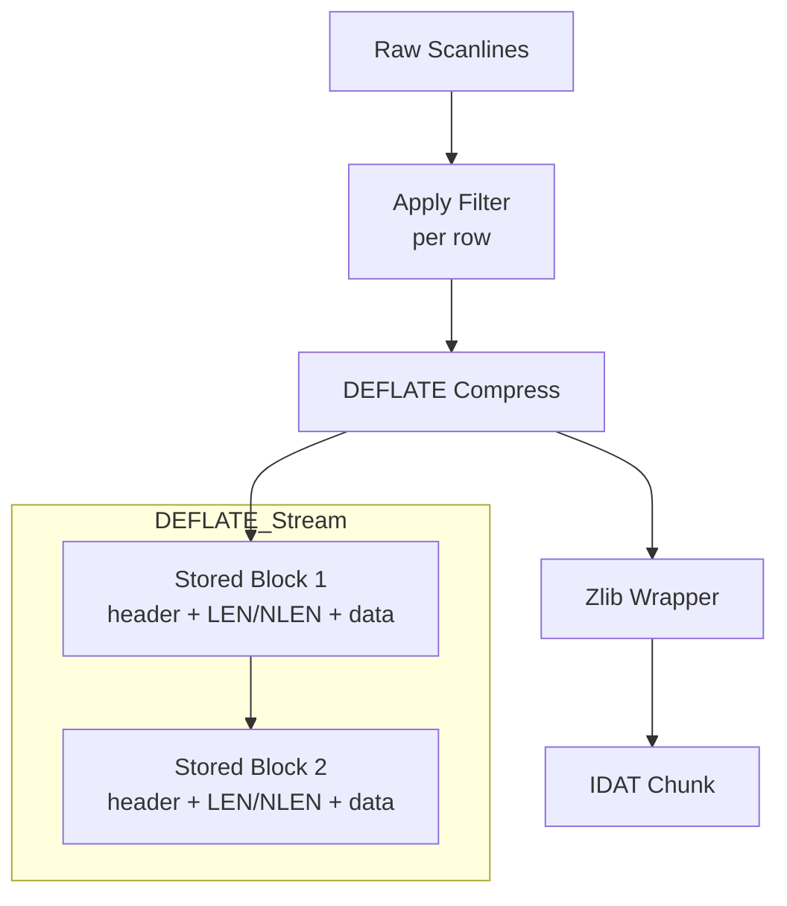

# DEFLATE Stored Blocks: Uncompressed Data in PNG

This guide explains **stored blocks**, the simplest type of DEFLATE compression block used in PNG IDAT chunks.

---

## What are Stored Blocks?

**Stored blocks** are **uncompressed** DEFLATE blocks. They pass data through without any compression, which seems counterintuitive—but they serve important purposes:

| Use Case | Why Stored Blocks? |
|----------|-------------------|
| Small data | Overhead of compressed blocks exceeds savings |
| Already compressed data | PNG images have no patterns to exploit |
| Protocol simplicity | Stored blocks have the simplest format |

### Why Not Just Use Uncompressed Data?

Without DEFLATE wrapping, we'd need custom handling for:
- Block boundaries
- End-of-data detection
- Error detection

Stored blocks provide a standard way to include uncompressed data within the DEFLATE stream.

---

## Stored Block Format

Each stored block has a simple 3-part structure:

```text
┌─────────┬───────────────┬─────────────────────┬─────────────────────┐
│ 1 byte  │   0-3 bytes   │    N bytes          │     4 bytes         │
│ Header  │   (padding)   │    Data             │  LEN + NLEN         │
└─────────┴───────────────┴─────────────────────┴─────────────────────┘
```

### The Header Byte

The header is just **1 byte** with 8 bits:

```text
┌─────────────────────────────────────────────────────────────┐
│  bit 3     │  bits 0-2    │  bits 4-7                       │
│  BFINAL    │  TYPE=000    │  Padding (must be 0)            │
└─────────────────────────────────────────────────────────────┘
```

| Field | Value | Meaning |
|-------|-------|---------|
| TYPE | 000 | Stored block (not compressed) |
| BFINAL | 0 or 1 | 1 = last block, 0 = more blocks follow |
| Padding | 0 | Must be zeros (DEFLATE aligns to byte boundary) |

### Header Byte Values

| BFINAL | Header Byte (binary) | Header Byte (hex) |
|--------|---------------------|-------------------|
| 0 | 0000 0000 | 0x00 |
| 1 | 0000 0001 | 0x01 |

### Data Length (LEN) and Complement (NLEN)

After the header, we write the **LEN** and **NLEN** fields:

| Field | Size | Endian | Description |
|-------|------|--------|-------------|
| LEN | 2 bytes | Little-endian | Number of data bytes |
| NLEN | 2 bytes | Little-endian | One's complement of LEN |

**One's complement** means each bit is flipped:

```go
lenValue := uint16(256)     // 0x0100
nlenValue := ^lenValue      // 0xFEFF (flipped bits)
```

**Why NLEN?** It provides **error detection**. If LEN and NLEN don't match this relationship, the decoder knows data was corrupted.

### Maximum Size

A stored block can contain **at most 65,535 bytes** (2^16 - 1). Larger data must be split into multiple blocks.

---

## Implementation

### Header Writing

```go
func WriteStoredBlockHeader(w io.Writer, final bool) error {
    var buf [1]byte
    if final {
        buf[0] = 0x01 // BFINAL=1, TYPE=000, padding=0
    } else {
        buf[0] = 0x00 // BFINAL=0, TYPE=000, padding=0
    }
    _, err := w.Write(buf[:])
    return err
}
```

### Footer Writing

```go
func WriteBlockFooter(w io.Writer, n uint32) error {
    if n > 65535 {
        return ErrInvalidBlockSize
    }

    var buf [4]byte
    binary.LittleEndian.PutUint16(buf[0:2], uint16(n))   // LEN
    nlen := ^uint16(n)                                   // One's complement
    binary.LittleEndian.PutUint16(buf[2:4], nlen)        // NLEN

    _, err := w.Write(buf[:])
    return err
}
```

### Complete Stored Block

```go
func WriteStoredBlock(w io.Writer, data []byte, final bool) error {
    if err := WriteStoredBlockHeader(w, final); err != nil {
        return err
    }
    if err := WriteBlockFooter(w, uint32(len(data))); err != nil {
        return err
    }
    return WriteBlockData(w, data)
}
```

---

## Example: Writing a Complete Block

Let's write "ABC" as a final stored block:

```text
Step 1: Header (final)
  0x01 (BFINAL=1, TYPE=000)

Step 2: Footer
  LEN  = 3 (0x0003)
  NLEN = 0xFFFC (one's complement of 3)

Step 3: Data
  "ABC" (0x41 0x42 0x43)

Result: 01 03 00 FC FF 41 42 43
        └─H┘ └──LEN/NLEN┘ └─DATA─┘
```

### Byte-by-Byte Breakdown

| Position | Byte (hex) | Description |
|----------|-----------|-------------|
| 0 | 0x01 | Header: final block |
| 1-2 | 0x03 0x00 | LEN = 3 (little-endian) |
| 3-4 | 0xFC 0xFF | NLEN = 0xFFFC (one's complement of 3) |
| 5-7 | 0x41 0x42 0x43 | Data: "ABC" |

---

## Integration in PNG IDAT Chunks

IDAT chunks contain DEFLATE-compressed image data, which may use stored blocks:



For Phase 1, we use **only stored blocks** (no real compression). This:
- Simplifies implementation
- Produces correct PNG format
- Is easily upgradable to real DEFLATE in Phase 2

---

## Error Handling

### Invalid Block Size

```go
const ErrInvalidBlockSize StoredBlockError = "stored block data size exceeds maximum (65535 bytes)"
```

Data larger than 65,535 bytes must be split:

```go
func SplitIntoStoredBlocks(data []byte) [][]byte {
    var blocks [][]byte
    for len(data) > 65535 {
        blocks = append(blocks, data[:65535])
        data = data[65535:]
    }
    blocks = append(blocks, data)
    return blocks
}
```

### Corruption Detection

Decoders verify NLEN:

```go
len := binary.LittleEndian.Uint16(data[1:3])
nlen := binary.LittleEndian.Uint16(data[3:5])

if nlen != ^len {
    return ErrCorruptBlock  // Data corrupted
}
```

---

## Comparison: Stored vs Compressed Blocks

| Feature | Stored Block | Compressed Block |
|---------|--------------|------------------|
| Compression | None | LZ77 + Huffman |
| Overhead | 5 bytes minimum | 5+ bytes |
| CPU usage | Minimal | Significant |
| Size reduction | None | Potentially large |
| Complexity | Simple | Complex |

---

## Summary

1. **Stored blocks** pass data through without compression
2. Format: `header(1) + LEN(2) + NLEN(2) + data(N)`
3. **LEN** = data length (little-endian)
4. **NLEN** = one's complement of LEN (error detection)
5. Maximum size: 65,535 bytes
6. Used in Phase 1 for simplicity; Phase 2 adds real compression

---

## Next Steps

- **Task 1.9**: Scanlines (`docs/learning/png/scanlines.md`) - Filter bytes and IDAT image data
- **Phase 2**: DEFLATE Compression (`docs/learning/png/deflate.md`) - LZ77 + Huffman coding

These files will be created when their respective tasks are implemented.
