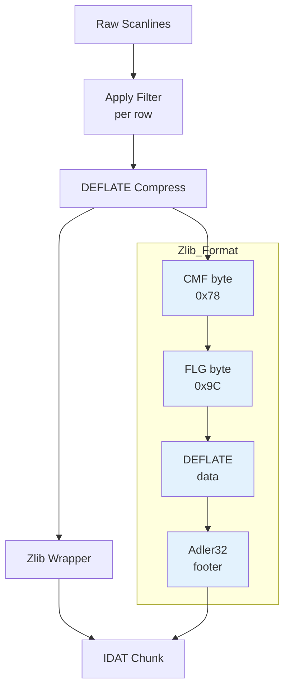
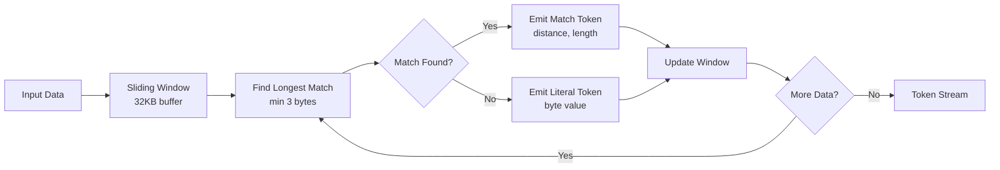
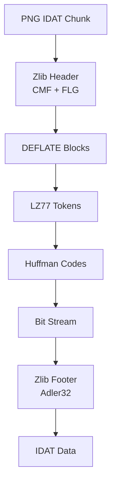

# PNG End Marker, Adler32, and Zlib Format

This guide explains three essential components that wrap PNG image data: the IEND chunk (end marker), the Adler32 checksum algorithm, and the zlib format header/footer.

---

## The IEND Chunk: End of File Marker

### What is IEND?

The IEND chunk marks the **end of the PNG data stream**. Every valid PNG file **must** end with an IEND chunk, which tells the decoder "there is nothing more to read."

### Why IEND?

The IEND chunk provides a clear boundary between image data and any potential trailing garbage:

- **Explicit termination**: Unlike some file formats that use file length, IEND provides an in-band signal
- **Corruption detection**: If IEND is missing or corrupted, the decoder knows the file was truncated
- **Future extensibility**: Allows adding optional chunks after IDAT without breaking decoders

### IEND Chunk Structure

```text
┌─────────────────────────────────────────────────────────────┐
│  4 bytes   │  4 bytes   │  0 bytes    │  4 bytes   │        │
│  Length=0  │   "IEND"   │   (none)    │   CRC32    │        │
└─────────────────────────────────────────────────────────────┘
```

| Field  | Size    | Value       | Purpose          |
| ------ | ------- | ----------- | ---------------- |
| Length | 4 bytes | 0x00000000  | No data field    |
| Type   | 4 bytes | "IEND"      | Chunk identifier |
| Data   | 0 bytes | -           | No content       |
| CRC32  | 4 bytes | CRC("IEND") | Integrity check  |

### Implementation

```go
func WriteIEND(w io.Writer) error {
	chunk := Chunk{chunkType: ChunkIEND, Data: nil}
	_, err := chunk.WriteTo(w)
	return err
}
```

The IEND chunk is simple because:

1. It has **zero data** (length = 0)
2. The CRC32 is computed over just the type "IEND"
3. Total size is always **12 bytes**

### PNG File Structure with IEND

```mermaid
flowchart TD
    A[PNG Signature<br/>8 bytes] --> B[IHDR Chunk<br/>25 bytes]
    B --> C[IDAT Chunk(s)<br/>compressed data]
    C --> D[IEND Chunk<br/>12 bytes]
    D --> E[End of File]

    style A fill:#c8e6c9
    style B fill:#ffe0b2
    style C fill:#ffccbc
    style D fill:#cfd8dc
```

### Common IEND CRC32

The CRC32 of "IEND" is always `0xAE426082`, which is verified by the test:

```go
expectedCRC := compress.CRC32([]byte("IEND"))
// expectedCRC == 0xAE426082
```

---

## Adler32 Checksum for Zlib

### What is Adler32?

Adler32 is a **32-bit checksum algorithm** used by the zlib compression format. It produces a fingerprint of data to detect corruption.

### Why Adler32 Instead of CRC32?

| Feature         | CRC32     | Adler32      |
| --------------- | --------- | ------------ |
| Speed           | Slower    | **Faster**   |
| Error Detection | Excellent | Very Good    |
| Streaming       | Good      | **Better**   |
| Memory Usage    | Higher    | **Lower**    |
| RFC 1950 (zlib) | Not used  | **Required** |

Adler32 is faster and uses less memory than CRC32, making it ideal for streaming compression scenarios. The slightly weaker error detection is acceptable for compression applications.

### How Adler32 Works

The algorithm maintains two running 16-bit sums, **s1** and **s2**, both modulo 65521 (a prime number):

```go
const adler32Mod = 65521

func Adler32(data []byte) uint32 {
	if len(data) == 0 {
		return 1  // Empty data returns 1
	}

	s1 := uint32(1)
	s2 := uint32(0)

	for _, b := range data {
		s1 = (s1 + uint32(b)) % adler32Mod
		s2 = (s2 + s1) % adler32Mod
	}

	return s2<<16 | s1
}
```

### Algorithm Visualization

```mermaid
flowchart LR
    A[Input Bytes] --> B[s1 = s1 + byte mod 65521]
    B --> C[s2 = s2 + s1 mod 65521]
    C --> D{Next byte?}
    D -->|Yes| B
    D -->|No| E[Result = s2<<16 | s1]

    style B fill:#e3f2fd
    style C fill:#e3f2fd
```

### RFC 1950 Test Vectors

| Input      | Adler32    |
| ---------- | ---------- |
| "" (empty) | 0x00000001 |
| "A" (0x41) | 0x00420042 |
| "ABC"      | 0x018D00C7 |

### Streaming Interface

For large data, we implement `hash.Hash32` for streaming computation:

```go
type adler32Writer struct {
	s1 uint32
	s2 uint32
}

func NewAdler32() hash.Hash32 {
	return &adler32Writer{s1: 1, s2: 0}
}

func (a *adler32Writer) Write(p []byte) (n int, err error) {
	for _, b := range p {
		a.s1 = (a.s1 + uint32(b)) % adler32Mod
		a.s2 = (a.s2 + a.s1) % adler32Mod
	}
	return len(p), nil
}
```

This allows processing data in chunks without loading everything into memory.

---

## Zlib Format: Header and Footer

### What is Zlib?

**Zlib** (RFC 1950) is a wrapper format that adds a header and footer around DEFLATE-compressed data. PNG uses zlib to wrap the compressed image data in IDAT chunks.

### Why Zlib?

Zlib provides:

1. **Header**: Specifies compression method, window size, and compression level
2. **Footer**: Contains Adler32 checksum of original (uncompressed) data
3. **Validation**: Check bits detect header corruption

### Zlib Stream Structure

```text
┌─────────┬─────────┬───────────────────┬─────────────┐
│  CMF    │  FLG    │  DEFLATE data     │  Adler32    │
│  (1B)   │  (1B)   │  (N bytes)        │  (4 bytes)  │
└─────────┴─────────┴───────────────────┴─────────────┘
```

### Zlib Header: CMF Byte

The **Compression Method and Flags** (CMF) byte specifies the algorithm and window size:

```text
┌─────────────────────────────────────────────┐
│  bits 0-3  │  bits 4-7                       │
│  CM=8      │  CINFO (window size = 2^CINFO) │
└─────────────────────────────────────────────┘
```

| CM (bits 0-3) | Meaning                    |
| ------------- | -------------------------- |
| 8             | DEFLATE (only valid value) |
| Other         | Reserved or invalid        |

| CINFO (bits 4-7) | Window Size |
| ---------------- | ----------- |
| 8                | 256         |
| 9                | 512         |
| 10               | 1024        |
| 11               | 2048        |
| 12               | 4096        |
| 13               | 8192        |
| 14               | 16384       |
| 15               | 32768       |

### Implementation

```go
func cmfByte(windowSize int) (byte, error) {
	if windowSize&(windowSize-1) != 0 {
		return 0, ErrInvalidWindowSize
	}

	wlog := bits.TrailingZeros(uint(windowSize))
	cinfo := wlog - 8
	if cinfo < 0 || cinfo > 7 {
		return 0, ErrInvalidWindowSize
	}

	cm := 8  // DEFLATE
	return byte((cm & 0x0F) | ((cinfo & 0x0F) << 4)), nil
}

func WriteCMF(w io.Writer, windowSize int) error {
	cmf, err := cmfByte(windowSize)
	if err != nil {
		return err
	}
	var buf [1]byte
	buf[0] = cmf
	_, err = w.Write(buf[:])
	return err
}
```

### Zlib Header: FLG Byte

The **Flags** (FLG) byte contains compression level, dictionary flag, and check bits:

```text
┌─────────────────────────────────────────────────────────────┐
│  bit 5     │  bits 6-7  │  bits 0-4                        │
│  FDICT=0   │  FLEVEL    │  FCHECK                          │
└─────────────────────────────────────────────────────────────┘
```

| FDICT (bit 5) | Meaning                   |
| ------------- | ------------------------- |
| 0             | No preset dictionary      |
| 1             | Preset dictionary present |

| FLEVEL (bits 6-7) | Meaning             |
| ----------------- | ------------------- |
| 0                 | Uncompressed        |
| 1                 | Fastest compression |
| 2                 | Default compression |
| 3                 | Best compression    |

### FCHECK Calculation

The **FCHECK** field is computed so that `(CMF * 256 + FLG) % 31 == 0`. This allows decoders to detect header corruption:

```go
func WriteFLG(w io.Writer, level uint8) error {
	fdict := uint8(0)    // No preset dictionary
	flevel := level & 3  // Compression level
	base := (flevel << 6) | ((fdict & 1) << 5)

	fcheck := 31 - ((int(lastCMF)*256 + int(base)) % 31)
	if fcheck == 31 {
		fcheck = 0
	}

	flg := base | uint8(fcheck)
	var buf [1]byte
	buf[0] = flg
	_, err := w.Write(buf[:])
	return err
}
```

### Common Zlib Headers

| Header Bytes | Window Size | Compression Level |
| ------------ | ----------- | ----------------- |
| 78 01        | 256         | Level 0           |
| 78 5E        | 32768       | Level 1           |
| **78 9C**    | **32768**   | **Level 2**       |
| 78 DA        | 32768       | Level 3           |

The sequence `78 9C` is the most common zlib header (DEFLATE, window=32768, level=2).

### Zlib Footer: Adler32

The footer contains the 4-byte Adler32 checksum of the **original uncompressed** data:

```go
func WriteAdler32Footer(w io.Writer, checksum uint32) error {
	var buf [4]byte
	binary.BigEndian.PutUint32(buf[:], checksum)
	_, err := w.Write(buf[:])
	return err
}
```

**Big-endian format**: The checksum is stored most-significant byte first.

### Complete Zlib Stream Example

```text
Byte 0:   0x78      (CMF: DEFLATE, window=32)
Byte 1:   0x9C      (FLG: check bits=0, no dict, level=2)
Bytes 2+: [DEFLATE compressed image scanlines]
Last 4:   [Adler32 checksum of original scanlines]
```

### Integration in PNG



---

## Summary

### Component Comparison

| Component   | File                          | Size     | Purpose            |
| ----------- | ----------------------------- | -------- | ------------------ |
| IEND Chunk  | `src/png/iend_writer.go`      | 12 bytes | Marks end of PNG   |
| Adler32     | `src/compress/adler32.go`     | N/A      | Checksum algorithm |
| Zlib CMF    | `src/compress/zlib_header.go` | 1 byte   | Method + window    |
| Zlib FLG    | `src/compress/zlib_header.go` | 1 byte   | Level + check bits |
| Zlib Footer | `src/compress/zlib_footer.go` | 4 bytes  | Adler32 checksum   |

### Key Formulas

**Adler32 checksum**:

```
s1 = (s1 + byte) % 65521
s2 = (s2 + s1) % 65521
checksum = (s2 << 16) | s1
```

**CMF byte**:

```
CMF = compression_method | (window_log << 4)
     = 8 | (log2(window_size) << 4)
```

**FLG byte**:

```
FLG = flevel << 6 | fdict << 5 | fcheck
where fcheck = 31 - ((CMF*256 + base) % 31)
```

**Validation**:

```
(CMF * 256 + FLG) % 31 == 0
```

---

## Inside DEFLATE: LZ77 Tokens and Huffman Coding

DEFLATE compression (RFC 1951) is the algorithm used inside zlib-wrapped data. It combines two techniques:

1. **LZ77**: Finds repeated sequences and replaces them with back-references
2. **Huffman Coding**: Compresses the token stream using variable-length codes

### LZ77 Tokenization

LZ77 scans the input data and emits either:

- **Literal tokens**: Raw byte values (0-255)
- **Match tokens**: Back-references with (distance, length) pairs

#### DEFLATE Constraints

Our LZ77 implementation enforces DEFLATE limits:

- **Minimum match length**: 3 bytes (shorter matches don't save space)
- **Maximum match length**: 258 bytes
- **Maximum distance**: 32,768 bytes (32KB sliding window)

#### How LZ77 Works



**Example**: Input `"ABCABCABC"` produces:

- Literals: `'A', 'B', 'C'`
- Match: `(distance=3, length=6)` - references the first "ABC" and copies 6 bytes

### Huffman Coding

Huffman coding assigns shorter bit sequences to more frequent symbols, reducing overall size.

#### Canonical Codes

DEFLATE uses **canonical Huffman codes** (RFC 1951):

- Codes are assigned deterministically based on code lengths
- Same length codes are assigned sequentially
- Codes are stored **LSB-first** (bit-reversed) for DEFLATE compatibility

#### Code Generation Process

1. **Count frequencies**: How often does each symbol appear?
2. **Build Huffman tree**: Connect symbols based on frequency
3. **Extract code lengths**: Traverse tree to get length for each symbol
4. **Canonicalize**: Assign codes in order (by length, then symbol value)

**Example**: Symbols with frequencies `[5, 3, 2, 1]`:

- Most frequent gets shortest code (length 1)
- Least frequent gets longest code (length 3)
- Codes are assigned: `0`, `10`, `110`, `111`

#### Why LSB-First Storage?

DEFLATE writes bits LSB-first (least significant bit first). For example, the code `"100"` (MSB-first) is stored as `"001"` (LSB-first). Our `ReverseBits()` function converts between these representations.

### Integration: IDAT → Zlib → DEFLATE



The complete flow:

1. **PNG scanlines** → Filter bytes + pixel data
2. **LZ77 encoding** → Token stream (literals + matches)
3. **Huffman coding** → Variable-length bit codes
4. **DEFLATE blocks** → Wrapped with block headers
5. **Zlib wrapper** → CMF/FLG header + Adler32 footer

---

## Next Steps

The following topics are now implemented:

- **Task 1.8**: Stored Blocks (`docs/learning/png/stored-blocks.md`) - Uncompressed DEFLATE blocks (LEN/NLEN)
- **Task 1.9**: PNG Scanlines (`docs/learning/png/scanlines.md`) - Filter bytes and IDAT image data
- **Phase 2.1**: LZ77 Tokenization - Back-reference compression with DEFLATE constraints
- **Phase 2.2**: Huffman Coding - Variable-length codes with canonical assignment

Future phases will add:

- **Phase 2.3+**: Fixed and dynamic Huffman tables
- **Phase 2.4+**: Bit writer for DEFLATE output
- **Phase 3**: PNG filter selection for better compression
